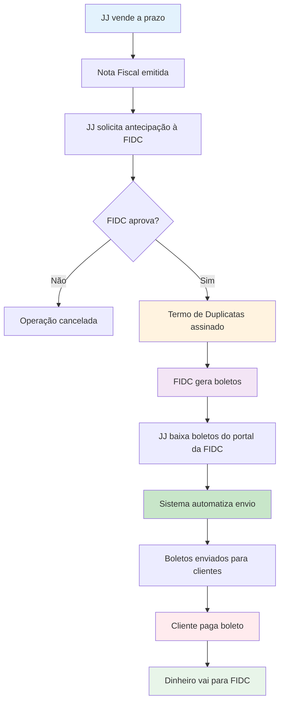

# Contexto de negócio

Este documento explica o contexto de negócio do sistema de automação de boletos, facilitando o entendimento de qualquer pessoa nova na empresa — seja desenvolvedor, operador ou gestor.

## O que é antecipação de títulos

A JJ trabalha com **antecipação de recebíveis**: quando a empresa vende um produto ou serviço a prazo, ela tem boletos a receber no futuro. Em vez de esperar o vencimento, a JJ pode antecipar esse dinheiro através de uma FIDC (Fundo de Investimento em Direitos Creditórios).

<Tip>
**Analogia simples**: Podemos comparar com um banco. A JJ tem um boleto de R$ 10.000 para receber em 60 dias. A FIDC antecipa esse valor hoje, pagando R$ 9.500 para a JJ (descontando uma taxa). Quando o cliente pagar o boleto, o dinheiro vai direto para a FIDC.
</Tip>

### Como funciona na prática

1. **JJ vende a prazo** → Cliente recebe mercadoria, nota fiscal é emitida
2. **JJ solicita antecipação** → Envia documentação para a FIDC
3. **FIDC aprova operação** → Analisa crédito e aprova antecipação
4. **JJ recebe o dinheiro antecipado** → Valor cai na conta (menos a taxa)
5. **Cliente paga o boleto** → Pagamento vai direto para a FIDC

<Note>
A JJ trabalha com 4 FIDCs diferentes, cada uma com suas próprias regras, taxas e processos. O sistema de automação precisa lidar com essas diferenças.
</Note>

## O que são FIDCs

**FIDC** significa **Fundo de Investimento em Direitos Creditórios**. São fundos regulados pela CVM (Comissão de Valores Mobiliários) que compram direitos de crédito de empresas.

### As 4 FIDCs da JJ

A JJ trabalha com 4 FIDCs parceiras:

<CardGroup cols={2}>
  <Card title="Capital RS" icon="building" color="#0e639c">
    **CAPITAL RS FIDC NP MULTISSETORIAL**
    
    CNPJ: 12.910.463/0001-70
  </Card>
  <Card title="Novax" icon="landmark" color="#107c10">
    **Novax Fundo de Investimento em Direitos Creditórios**
  </Card>
  <Card title="Credvale" icon="credit-card" color="#d83b01">
    **CREDVALE FUNDO DE INVESTIMENTO EM DIREITOS CREDITORIOS MULTISSETORIAL**
    
    Chamado internamente de "Credit Valley"
  </Card>
  <Card title="Squid" icon="wallet" color="#8764b8">
    **SQUID FUNDO DE INVESTIMENTO EM DIREITOS CREDITORIOS**
  </Card>
</CardGroup>

### Características das FIDCs

- **Cada FIDC tem seu próprio portal/site** onde a JJ faz upload de documentos e acompanha operações
- **Cada FIDC tem regras específicas** de aprovação, taxas e prazos
- **Cada FIDC gera boletos em formatos diferentes** (layouts de PDF variam)
- **Todas as FIDCs exigem documentação completa** (nota fiscal, termo de duplicatas, etc.)

## Por que a JJ envia boletos se a FIDC já envia?

Esta é uma dúvida comum. A resposta tem a ver com **relacionamento com o cliente** e **controle operacional**.

### O processo completo

<Steps>
  <Step title="FIDC gera os boletos">
    Após aprovar a operação, a FIDC gera os boletos bancários em PDF e disponibiliza no portal deles.
  </Step>
  <Step title="JJ baixa os boletos">
    A equipe de cobrança da JJ acessa o portal da FIDC e baixa os boletos gerados.
  </Step>
  <Step title="JJ envia do próprio e-mail">
    A JJ envia os boletos para os clientes usando o e-mail institucional `cobranca@jotajota.net.br` (ou `cobranca@jj.net.br`).
  </Step>
  <Step title="Cliente recebe e paga">
    O cliente recebe o boleto da JJ (não da FIDC) e efetua o pagamento.
  </Step>
</Steps>

### Por que esse processo?

**1. Manter o relacionamento com o cliente**
- O cliente não precisa saber que a JJ antecipou o recebível
- A comunicação continua sendo JJ ↔ Cliente
- Evita confusão ("quem é essa FIDC que está me cobrando?")

**2. Controle operacional**
- A JJ mantém histórico completo de envios
- Equipe de cobrança pode acompanhar quem recebeu e quem não recebeu
- Facilita o atendimento quando cliente liga perguntando sobre boleto

**3. Auditoria e compliance**
- ADM sempre recebe cópia (CC) de todos os e-mails
- Relatórios de auditoria registram cada envio
- Rastreabilidade completa para fins contábeis e fiscais

<Warning>
**Importante**: O boleto é da FIDC (código de barras aponta para conta da FIDC), mas o envio é feito pela JJ. Isso garante que o cliente pague para a FIDC (que antecipou o dinheiro) mas mantenha contato com a JJ.
</Warning>

<Note>
Algumas FIDCs (como a Capital RS) também enviam boletos diretamente para o cliente por conta própria. Portanto, o cliente pode receber o mesmo boleto duas vezes: uma pela FIDC e outra pela JJ. Isso é esperado e não é um erro.
</Note>

## Fluxo financeiro simplificado

Veja como o processo completo funciona do início ao fim:



<Note>
**O sistema de automação atua na Fase 4** (destaque verde no diagrama). As demais fases — venda, documentação, antecipação, geração de boletos e pagamento — são processos manuais ou de responsabilidade da FIDC.
</Note>

### Detalhamento do fluxo

**Fase 1: Venda e documentação**
- JJ vende produto/serviço a prazo
- Sistema Viasoft (ERP) emite nota fiscal eletrônica (NFe)
- XML da NFe contém todos os dados: cliente, valor, vencimento, emails

**Fase 2: Antecipação**
- JJ envia documentação para FIDC (nota fiscal, contrato, etc.)
- FIDC analisa crédito do cliente
- Se aprovado, FIDC e JJ assinam Termo de Duplicatas

**Fase 3: Geração de boletos**
- FIDC gera boletos bancários em PDF
- Boletos ficam disponíveis no portal da FIDC
- JJ baixa os boletos manualmente

**Fase 4: Envio automatizado (onde o sistema atua)**
- Operador coloca boletos na pasta `BoletosEntrada/`
- Sistema renomeia boletos (extrai dados do PDF)
- Sistema valida dados com XMLs das notas fiscais
- Sistema cria e-mails no Outlook com boletos anexados
- E-mails são enviados para clientes (com cópia para ADM)

<Note>
**Atualmente o sistema opera em modo preview** (MODO_PREVIEW = True): em vez de enviar automaticamente, ele abre os e-mails no Outlook para que o operador confira e clique "Enviar" manualmente. Este modo foi mantido desde a fase de testes. Consulte a seção de flags operacionais na página [Estrutura do Projeto](/automacao-de-boletos/estrutura-do-projeto) para detalhes.
</Note>

**Fase 5: Pagamento**
- Cliente recebe boleto e paga no banco
- Dinheiro vai direto para conta da FIDC
- FIDC confirma recebimento e baixa a operação

## Glossário de termos

<Accordion title="FIDC">
**Fundo de Investimento em Direitos Creditórios**. Fundo regulado pela CVM que compra direitos de crédito (boletos a receber) de empresas, antecipando o valor mediante uma taxa.
</Accordion>

<Accordion title="Termo de Duplicatas">
Documento legal que formaliza a cessão de crédito da JJ para a FIDC. Assinado após aprovação da operação, autoriza a FIDC a receber os pagamentos dos boletos.
</Accordion>

<Accordion title="Operação">
Conjunto de boletos antecipados em uma única transação. Uma operação pode conter vários boletos de um mesmo cliente ou de clientes diferentes. Cada FIDC mantém numeração sequencial própria (ex: "Operação 167" da Capital RS). Essa numeração é usada para organizar pastas no servidor e referências internas.
</Accordion>

<Accordion title="Antecipação">
Processo de receber hoje um valor que só venceria no futuro, mediante desconto de uma taxa. Também chamado de "antecipação de recebíveis" ou "desconto de duplicatas".
</Accordion>

<Accordion title="XML NFe">
Arquivo XML da Nota Fiscal Eletrônica, gerado pelo sistema Viasoft (ERP da JJ). Contém todos os dados da venda: cliente, CNPJ, valor, emails de contato, duplicatas, etc.
</Accordion>

<Accordion title="Boleto">
Documento de cobrança bancária em formato PDF. Contém código de barras, dados do pagador, valor, vencimento e instruções de pagamento. Gerado pela FIDC após aprovação da operação.
</Accordion>

<Accordion title="Viasoft">
Sistema ERP (Enterprise Resource Planning) usado pela JJ para gestão empresarial. Emite notas fiscais eletrônicas, cadastra clientes e gera os XMLs das NFes utilizados pelo sistema de automação.
</Accordion>

<Accordion title="Duplicata">
Título de crédito que representa uma venda a prazo. Cada parcela de uma venda pode gerar uma duplicata. O XML da NFe lista todas as duplicatas com número, vencimento e valor.
</Accordion>

## Perguntas frequentes

### O que acontece se o cliente diz que não recebeu o boleto?

A equipe de cobrança acessa os relatórios de auditoria do sistema, que registram:
- Data e hora exata do envio
- E-mails de destino (até 2 por cliente)
- Status de validação (aprovado/rejeitado)
- Cópia do boleto enviado

Com essas informações, a equipe pode:
1. Confirmar que o e-mail foi enviado
2. Verificar se o e-mail está correto
3. Reenviar o boleto manualmente se necessário

#### Organização de arquivos no servidor

Cada operação é organizada em uma estrutura hierárquica no servidor da JJ:

```
Servidor JJ/
└── Cobranças/
    └── Cobrança [FIDC]/
        └── [Ano]/
            └── Operação [Número]/
                ├── Termo de Duplicatas (assinado)
                ├── Notas Fiscais (XML + PDF)
                └── Boletos processados (histórico)
```

**Exemplo real:**
```
Servidor JJ > Cobranças > Cobrança RS > 2026 > Operação 167
```

Cada FIDC mantém numeração sequencial própria (ex: a última operação com a Capital RS foi a "Operação 167"). Essa estrutura facilita a localização de documentos e histórico de envios.

<Tip>
O sistema mantém cópia de todos os boletos enviados na pasta `BoletosEnviados/`, facilitando o reenvio.
</Tip>

### Quantos e-mails o cliente recebe?

O sistema envia para **até 2 e-mails por cliente**, conforme cadastrado no XML da nota fiscal.

**Regras de validação:**
- E-mails devem estar completos (não truncados)
- E-mails devem ter formato válido (regex)
- Se houver mais de 2 e-mails no XML, o sistema usa apenas os 2 primeiros válidos
- Se o segundo e-mail exceder o limite de caracteres do sistema, ele é silenciosamente descartado e o envio segue apenas para o primeiro e-mail
- Se não houver nenhum e-mail válido, o boleto é rejeitado

**Exemplo de XML com 2 e-mails:**
```xml
<email>compras@cliente.com.br</email>
<email>financeiro@cliente.com.br</email>
```

<Tip>
Se um cliente com 2 e-mails cadastrados reportar que recebeu boleto em apenas um dos e-mails, verifique se o segundo e-mail cadastrado no Viasoft não é muito longo (excesso de caracteres). Nesse caso, o sistema envia apenas para o primeiro.
</Tip>

### De onde vem o e-mail do cliente?

Os e-mails vêm do **XML da nota fiscal eletrônica (NFe)**, que por sua vez puxa do **cadastro do cliente no Viasoft** (ERP da JJ).

**Fluxo de dados:**
1. Cliente é cadastrado no Viasoft com e-mails de contato
2. Ao emitir NFe, Viasoft inclui os e-mails no XML
3. Sistema de automação lê os e-mails do XML
4. Sistema valida e usa os e-mails para envio

<Warning>
Se o cadastro do cliente no Viasoft estiver desatualizado ou com e-mails inválidos, o sistema rejeitará o boleto. É fundamental manter o cadastro atualizado.
</Warning>

### Por que o sistema valida em 5 camadas?

A validação em 5 camadas (XML → CNPJ → Nome → Valor → Email) garante que:

1. **Boleto corresponde à nota fiscal correta** (evita enviar boleto errado)
2. **Cliente é o mesmo** (CNPJ e nome conferem)
3. **Valor está correto** (sem divergências de centavos)
4. **E-mails são válidos** (evita bounces e não-entrega)
5. **Rastreabilidade completa** (auditoria pode provar que tudo foi validado)

Essa validação rigorosa protege a JJ de erros operacionais e garante compliance com processos internos e externos.

### O que acontece com boletos rejeitados?

Boletos que não passam na validação são:
1. **Movidos para pasta de erros** (não são enviados)
2. **Registrados em relatório de erros** com motivo da rejeição
3. **Notificados para equipe de cobrança** via log do sistema

A equipe pode então:
- Corrigir o cadastro no Viasoft
- Solicitar novo XML da nota fiscal
- Processar o boleto novamente

### Quem sempre recebe cópia dos e-mails?

O e-mail `adm@jotajota.net.br` (ou `adm@jj.net.br`) **sempre recebe cópia (CC)** de todos os e-mails enviados, independente da FIDC ou cliente.

Isso garante:
- Supervisão de todas as operações
- Backup de comunicação
- Auditoria em tempo real
- Suporte rápido em caso de problemas

#### Regras de CC por FIDC

Cada FIDC tem configuração específica de e-mails em cópia:

| FIDC | E-mails em cópia (CC) |
|------|----------------------|
| **Capital RS** | ADM apenas |
| **Novax** | Controladoria Novax + ADM |
| **Credvale (Credit Valley)** | Nicole + ADM |
| **Squid** | ADM apenas |

<Note>
Os endereços específicos de cada cópia (controladoria Novax, Nicole) estão configurados no `FIDC_CONFIG` do sistema. Consulte a página [Estrutura do Projeto](/automacao-de-boletos/estrutura-do-projeto) para detalhes técnicos.
</Note>
