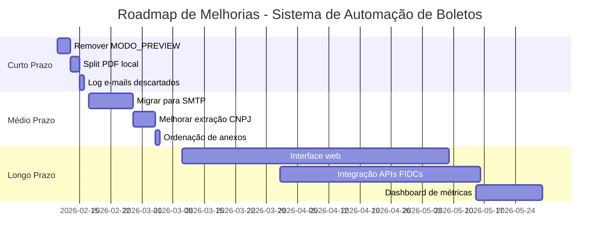

# Dívida técnica e roadmap

Este documento cataloga os problemas técnicos conhecidos do sistema, sua priorização e o plano de melhorias recomendado.

## Inventário de dívida técnica

### 1. MODO_PREVIEW travado em True

**Descrição**: A flag `MODO_PREVIEW = True` está ativa desde a fase de testes e nunca foi revertida após a saída do desenvolvedor original. Com esta flag ativa, o sistema abre e-mails no Outlook para envio manual ao invés de enviar automaticamente.

**Impacto**: 
- **Operacional**: Operador precisa clicar manualmente em "Enviar" para cada e-mail
- **Eficiência**: Elimina o benefício da automação completa
- **Risco de erro**: Operador pode esquecer de enviar ou enviar para destinatário errado

**Risco**: 
- **Baixo**: Sistema funciona corretamente, apenas requer intervenção manual
- **Segurança**: Flag ativa funciona como "trava de segurança" adicional

**Complexidade de correção**: 
- **Técnica**: Pequena (P) - Mudar `MODO_PREVIEW = False` no `config.py`
- **Validação**: Média (M) - Requer testes extensivos com equipe de cobrança antes de ativar envio automático

**Localização**: `config.py`, linha 91

```python
MODO_PREVIEW = True  # Mudar para False após validação
```

<Warning>
**Ação recomendada**: Não alterar sem validação completa com a equipe de cobrança. Esta flag funciona como proteção contra envios acidentais.
</Warning>

---

### 2. Dependência do iLovePDF (dados financeiros em site público)

**Descrição**: [VERIFICAR: O sistema atual não parece usar iLovePDF no código analisado. Esta dívida pode ter sido mencionada em versões anteriores ou em processos manuais. Confirmar com a equipe se ainda é relevante.]

**Impacto**: 
- **Segurança**: Dados financeiros sensíveis (boletos, notas fiscais) podem ser expostos em serviço de terceiros
- **Compliance**: Possível violação de políticas de segurança da informação
- **Dependência externa**: Sistema depende de serviço online que pode ficar indisponível

**Risco**: 
- **Alto**: Exposição de dados financeiros confidenciais
- **Regulatório**: Possível não-conformidade com LGPD

**Complexidade de correção**: 
- **Técnica**: Média (M) - Implementar split de PDF local usando PyPDF2 ou pdfplumber
- **Tempo**: 1-2 dias de desenvolvimento + testes

**Solução proposta**:
```python
# Substituir iLovePDF por biblioteca local
import PyPDF2

def split_pdf_local(caminho_pdf, paginas):
    """Split PDF localmente sem enviar para serviço externo"""
    with open(caminho_pdf, 'rb') as file:
        reader = PyPDF2.PdfReader(file)
        writer = PyPDF2.PdfWriter()
        
        for pagina in paginas:
            writer.add_page(reader.pages[pagina])
        
        output_path = f"{caminho_pdf}_split.pdf"
        with open(output_path, 'wb') as output:
            writer.write(output)
    
    return output_path
```

---

### 3. Caixa preta operacional

**Descrição**: A operadora só tem acesso ao executável `.exe` (~36 MB), sem acesso ao código-fonte ou capacidade de fazer ajustes. Qualquer problema ou necessidade de mudança requer desenvolvedor.

**Impacto**: 
- **Autonomia**: Operadora não consegue resolver problemas simples sozinha
- **Tempo de resposta**: Qualquer ajuste depende de disponibilidade de desenvolvedor
- **Conhecimento**: Operadora não entende como o sistema funciona internamente

**Risco**: 
- **Médio**: Sistema pode ficar inoperante se desenvolvedor não estiver disponível
- **Continuidade**: Conhecimento concentrado em uma pessoa

**Complexidade de correção**: 
- **Técnica**: Grande (G) - Requer mudança de arquitetura
- **Organizacional**: Grande (G) - Requer treinamento e documentação

**Soluções possíveis**:
1. **Curto prazo**: Documentação detalhada + manual do operador
2. **Médio prazo**: Interface web com configurações editáveis
3. **Longo prazo**: Sistema modular com plugins configuráveis

---

### 4. Ordenação de anexos fora de ordem cronológica

**Descrição**: Quando múltiplos boletos são anexados ao mesmo e-mail, eles não são ordenados cronologicamente por data de vencimento. Isso dificulta a visualização do cliente.

**Impacto**: 
- **Experiência do usuário**: Cliente precisa abrir cada boleto para verificar vencimentos
- **Profissionalismo**: Aparência desorganizada
- **Risco de pagamento errado**: Cliente pode pagar boleto errado por confusão

**Risco**: 
- **Baixo**: Não impede funcionamento, apenas dificulta uso

**Complexidade de correção**: 
- **Técnica**: Pequena (P) - Ordenar lista de anexos antes de adicionar ao e-mail
- **Tempo**: 2-4 horas

**Solução proposta**:
```python
def ordenar_boletos_por_vencimento(boletos_paths):
    """
    Ordena boletos por data de vencimento antes de anexar
    
    Retorna: Lista de caminhos ordenados
    """
    boletos_com_data = []
    
    for caminho in boletos_paths:
        data_venc = extrair_data_vencimento_do_pdf(caminho)
        if data_venc and data_venc != "A definir":
            # Converter DD/MM/YYYY para objeto datetime
            dia, mes, ano = data_venc.split('/')
            dt = datetime(int(ano), int(mes), int(dia))
            boletos_com_data.append((caminho, dt))
        else:
            # Boletos sem data vão para o final
            boletos_com_data.append((caminho, datetime.max))
    
    # Ordenar por data
    boletos_com_data.sort(key=lambda x: x[1])
    
    return [caminho for caminho, _ in boletos_com_data]

# Usar na função abrir_email_outlook:
anexos_ordenados = ordenar_boletos_por_vencimento(list(g['boletos']))
anexos_finais = anexos_ordenados + list(notas_anexos)
```

---

### 5. Limitação de 2 e-mails + descarte silencioso do 2º se for longo

**Descrição**: O sistema limita a 2 e-mails por cliente (`MAX_EMAILS_POR_CLIENTE = 2`). Se o segundo e-mail exceder o limite de caracteres do sistema, ele é **silenciosamente descartado** e o envio segue apenas para o primeiro e-mail.

**Impacto**: 
- **Comunicação**: Cliente pode não receber boleto em e-mail secundário (financeiro, contabilidade)
- **Transparência**: Sistema não avisa que descartou o segundo e-mail
- **Suporte**: Operadora não sabe que houve descarte até cliente reclamar

**Risco**: 
- **Médio**: Cliente pode não receber boleto e atrasar pagamento
- **Reputacional**: Cliente pode achar que JJ não enviou boleto

**Complexidade de correção**: 
- **Técnica**: Pequena (P) - Adicionar log de aviso quando e-mail for descartado
- **Tempo**: 1-2 horas

**Solução proposta**:
```python
def validar_emails_com_log(emails, max_length=100):
    """
    Valida e-mails e registra descartes
    
    Retorna: (emails_validos, emails_descartados)
    """
    validos = []
    descartados = []
    
    for email in emails[:MAX_EMAILS_POR_CLIENTE]:
        if len(email) > max_length:
            descartados.append(email)
            print(f"   [AVISO] Email descartado (muito longo): {email[:50]}...")
            boleto_auditoria.adicionar_detalhe(
                "Email descartado", 
                False, 
                f"Email muito longo ({len(email)} caracteres): {email[:50]}..."
            )
        else:
            validos.append(email)
    
    return validos, descartados
```

---

### 6. BoletosEntrada_Backup/ sem documentação

**Descrição**: Existe uma pasta `BoletosEntrada_Backup/` na raiz do projeto, mas não há documentação sobre sua função. Não está claro se é backup automático, manual, ou se está em uso.

**Impacto**: 
- **Manutenção**: Desenvolvedores não sabem se podem deletar ou se é crítico
- **Espaço em disco**: Pode acumular arquivos desnecessários
- **Confusão**: Operadora pode não saber qual pasta usar

**Risco**: 
- **Baixo**: Provavelmente não afeta funcionamento

**Complexidade de correção**: 
- **Técnica**: Pequena (P) - Investigar código e documentar
- **Tempo**: 1 hora

**Ação recomendada**: 
1. Buscar no código por referências a `BoletosEntrada_Backup`
2. Perguntar à operadora se ela usa esta pasta
3. Documentar função ou remover se não for usada

---

### 7. Dois virtual environments (.venv/ e venv/)

**Descrição**: Existem dois ambientes virtuais Python na raiz do projeto: `.venv/` e `venv/`. Isso indica duplicação ou migração incompleta.

**Impacto**: 
- **Confusão**: Desenvolvedores não sabem qual usar
- **Espaço em disco**: ~500 MB duplicados
- **Dependências**: Podem estar desatualizadas em um dos ambientes

**Risco**: 
- **Baixo**: Não afeta funcionamento, apenas organização

**Complexidade de correção**: 
- **Técnica**: Pequena (P) - Deletar um dos ambientes
- **Tempo**: 15 minutos

**Ação recomendada**:
```bash
# Verificar qual está em uso
which python  # ou where python no Windows

# Deletar o não utilizado
rm -rf venv/  # ou .venv/ dependendo do caso

# Atualizar .gitignore para ignorar ambos
echo ".venv/" >> .gitignore
echo "venv/" >> .gitignore
```

---

### 8. [NOVO] Dependência crítica do Microsoft Outlook

**Descrição**: O sistema depende 100% do Microsoft Outlook instalado e configurado na máquina. Usa `pywin32` para automação COM, que só funciona no Windows com Outlook instalado.

**Impacto**: 
- **Portabilidade**: Sistema não funciona em Linux/Mac
- **Dependência**: Requer licença do Outlook
- **Falha única**: Se Outlook travar, sistema para completamente

**Risco**: 
- **Médio**: Sistema pode ficar inoperante se Outlook tiver problemas
- **Licenciamento**: Custo de licenças do Outlook

**Complexidade de correção**: 
- **Técnica**: Grande (G) - Requer refatoração completa do envio de e-mails
- **Tempo**: 1-2 semanas

**Solução proposta**: Migrar para SMTP direto
```python
import smtplib
from email.mime.multipart import MIMEMultipart
from email.mime.text import MIMEText
from email.mime.base import MIMEBase
from email import encoders

def enviar_email_smtp(email_to, assunto, corpo_html, anexos, cc_emails):
    """
    Envia e-mail via SMTP sem depender do Outlook
    """
    msg = MIMEMultipart()
    msg['From'] = 'cobranca@jotajota.net.br'
    msg['To'] = email_to
    msg['Cc'] = '; '.join(cc_emails)
    msg['Subject'] = assunto
    
    # Corpo HTML
    msg.attach(MIMEText(corpo_html, 'html'))
    
    # Anexos
    for arquivo in anexos:
        with open(arquivo, 'rb') as f:
            part = MIMEBase('application', 'octet-stream')
            part.set_payload(f.read())
            encoders.encode_base64(part)
            part.add_header('Content-Disposition', f'attachment; filename={os.path.basename(arquivo)}')
            msg.attach(part)
    
    # Enviar
    with smtplib.SMTP('smtp.jotajota.net.br', 587) as server:
        server.starttls()
        server.login('cobranca@jotajota.net.br', 'senha_segura')
        server.send_message(msg)
```

---

### 9. [NOVO] Validação de CNPJ com múltiplos padrões regex frágeis

**Descrição**: O código usa 5 padrões regex diferentes para extrair CNPJ de PDFs, cada um específico para um FIDC. Isso é frágil e difícil de manter.

**Impacto**: 
- **Manutenção**: Adicionar novo FIDC requer novo padrão regex
- **Falhas**: Se FIDC mudar layout do boleto, extração falha
- **Complexidade**: Código difícil de entender e debugar

**Risco**: 
- **Médio**: Mudança no layout de boleto quebra extração

**Complexidade de correção**: 
- **Técnica**: Média (M) - Implementar extração mais robusta
- **Tempo**: 3-5 dias

**Solução proposta**: Usar biblioteca de OCR + IA para extração mais robusta
```python
# Opção 1: Usar IA (já tem suporte no código, mas desabilitado)
USAR_IA = True  # Ativar IA para extração

# Opção 2: Usar OCR + validação de CNPJ
import pytesseract
from validate_docbr import CNPJ

def extrair_cnpj_com_ocr(caminho_pdf):
    """
    Extrai CNPJ usando OCR + validação
    Mais robusto que regex
    """
    # Converter PDF para imagem
    images = convert_from_path(caminho_pdf)
    
    # Extrair texto com OCR
    texto = pytesseract.image_to_string(images[0])
    
    # Buscar todos os padrões de CNPJ
    cnpjs_encontrados = re.findall(r'\d{2}\.?\d{3}\.?\d{3}/?\d{4}-?\d{2}', texto)
    
    # Validar CNPJs
    validador = CNPJ()
    for cnpj in cnpjs_encontrados:
        cnpj_limpo = normalizar_cnpj(cnpj)
        if validador.validate(cnpj_limpo):
            return cnpj_limpo
    
    return None
```

---

## Matriz de priorização

| Item | Impacto | Risco | Esforço | Prioridade |
|------|---------|-------|---------|------------|
| **1. MODO_PREVIEW = True** | Alto | Baixo | P | **P1** |
| **2. iLovePDF (dados públicos)** | Alto | Alto | M | **P1** |
| **3. Caixa preta operacional** | Médio | Médio | G | **P2** |
| **4. Ordenação de anexos** | Baixo | Baixo | P | **P3** |
| **5. Descarte silencioso de e-mail** | Médio | Médio | P | **P2** |
| **6. BoletosEntrada_Backup/** | Baixo | Baixo | P | **P3** |
| **7. Dois virtual environments** | Baixo | Baixo | P | **P3** |
| **8. Dependência do Outlook** | Médio | Médio | G | **P2** |
| **9. Regex frágil para CNPJ** | Médio | Médio | M | **P2** |

**Legenda**:
- **Esforço**: P (Pequeno: < 1 dia), M (Médio: 1-5 dias), G (Grande: > 1 semana)
- **Prioridade**: P1 (Crítico), P2 (Importante), P3 (Desejável)

---

## Roadmap sugerido

### Curto prazo (1-2 semanas)

<Steps>
  <Step title="Remover trava MODO_PREVIEW">
    **Objetivo**: Ativar envio automático de e-mails
    
    **Ações**:
    1. Validar com equipe de cobrança que sistema está estável
    2. Fazer backup completo do sistema
    3. Alterar `MODO_PREVIEW = False` no `config.py`
    4. Testar com 5-10 boletos reais em ambiente controlado
    5. Monitorar primeiros 50 envios automáticos
    6. Documentar procedimento de rollback se necessário
    
    **Responsável**: Desenvolvedor + Operadora
    
    **Tempo estimado**: 3 dias (incluindo testes)
  </Step>
  
  <Step title="Implementar split de PDF local">
    **Objetivo**: Eliminar dependência do iLovePDF
    
    **Ações**:
    1. Instalar PyPDF2: `pip install PyPDF2`
    2. Implementar função `split_pdf_local()`
    3. Substituir chamadas ao iLovePDF (se existirem)
    4. Testar com PDFs de todos os 4 FIDCs
    5. Validar que split mantém qualidade e formatação
    
    **Responsável**: Desenvolvedor
    
    **Tempo estimado**: 2 dias
  </Step>
  
  <Step title="Adicionar log de e-mails descartados">
    **Objetivo**: Transparência quando segundo e-mail for descartado
    
    **Ações**:
    1. Implementar função `validar_emails_com_log()`
    2. Adicionar avisos no console e relatório de auditoria
    3. Notificar operadora quando houver descarte
    4. Documentar no manual do operador
    
    **Responsável**: Desenvolvedor
    
    **Tempo estimado**: 1 dia
  </Step>
</Steps>

**Entregáveis**:
- Sistema com envio automático ativado (após validação)
- Split de PDF 100% local (sem serviços externos)
- Logs transparentes de e-mails descartados

---

### Médio prazo (1-2 meses)

<Steps>
  <Step title="Migrar para SMTP direto">
    **Objetivo**: Eliminar dependência do Outlook
    
    **Ações**:
    1. Configurar servidor SMTP da JJ
    2. Implementar função `enviar_email_smtp()`
    3. Criar modo híbrido (Outlook + SMTP)
    4. Testar envios via SMTP em paralelo com Outlook
    5. Migrar 100% para SMTP após validação
    6. Remover dependência `pywin32`
    
    **Benefícios**:
    - Sistema funciona em Linux/Mac
    - Não depende de licença do Outlook
    - Mais estável e previsível
    
    **Responsável**: Desenvolvedor + TI
    
    **Tempo estimado**: 1-2 semanas
  </Step>
  
  <Step title="Melhorar extração de CNPJ">
    **Objetivo**: Tornar extração mais robusta
    
    **Ações**:
    1. Ativar IA para extração (`USAR_IA = True`)
    2. Treinar modelo com boletos reais dos 4 FIDCs
    3. Implementar fallback inteligente (IA → OCR → Regex)
    4. Adicionar validação de CNPJ (dígitos verificadores)
    5. Criar testes automatizados com boletos de exemplo
    
    **Responsável**: Desenvolvedor
    
    **Tempo estimado**: 1 semana
  </Step>
  
  <Step title="Implementar ordenação de anexos">
    **Objetivo**: Melhorar experiência do cliente
    
    **Ações**:
    1. Implementar função `ordenar_boletos_por_vencimento()`
    2. Integrar na função `abrir_email_outlook()`
    3. Testar com múltiplos boletos
    4. Validar com equipe de cobrança
    
    **Responsável**: Desenvolvedor
    
    **Tempo estimado**: 1 dia
  </Step>
</Steps>

**Entregáveis**:
- Sistema independente do Outlook (via SMTP)
- Extração de CNPJ mais robusta (IA + OCR + Regex)
- Anexos ordenados cronologicamente

---

### Longo prazo (3+ meses)

<Steps>
  <Step title="Desenvolver interface web">
    **Objetivo**: Eliminar caixa preta operacional
    
    **Funcionalidades**:
    - Dashboard com status em tempo real
    - Upload de boletos via drag-and-drop
    - Visualização de logs e relatórios
    - Configuração de FIDCs e e-mails CC
    - Reprocessamento de boletos rejeitados
    - Histórico de envios com busca
    
    **Stack sugerida**:
    - Backend: FastAPI (Python)
    - Frontend: React + Tailwind CSS
    - Banco de dados: PostgreSQL
    - Deploy: Docker + Nginx
    
    **Responsável**: Equipe de desenvolvimento
    
    **Tempo estimado**: 2-3 meses
  </Step>
  
  <Step title="Integrar APIs das FIDCs">
    **Objetivo**: Automatizar download de boletos
    
    **Ações**:
    1. Mapear APIs disponíveis das 4 FIDCs
    2. Implementar autenticação e download automático
    3. Sincronizar boletos novos a cada X minutos
    4. Eliminar download manual do portal
    
    **Benefícios**:
    - Processo 100% automatizado (fim-a-fim)
    - Redução de erros humanos
    - Processamento em tempo real
    
    **Responsável**: Desenvolvedor + Contato com FIDCs
    
    **Tempo estimado**: 1-2 meses (depende de APIs)
  </Step>
  
  <Step title="Implementar dashboard de métricas">
    **Objetivo**: Visibilidade e análise de dados
    
    **Métricas**:
    - Taxa de sucesso por FIDC
    - Tempo médio de processamento
    - Boletos rejeitados (motivos)
    - Volume de envios por dia/semana/mês
    - Clientes com mais rejeições
    - Alertas de anomalias
    
    **Ferramentas**:
    - Grafana + Prometheus
    - Ou dashboard customizado em React
    
    **Responsável**: Desenvolvedor
    
    **Tempo estimado**: 2-3 semanas
  </Step>
</Steps>

**Entregáveis**:
- Interface web completa (substituindo .exe)
- Integração com APIs das FIDCs (download automático)
- Dashboard de métricas e análise

---

## Timeline visual



---

## Recomendações finais

### Prioridades imediatas (P1)

1. **Validar e remover MODO_PREVIEW**: Esta é a mudança de maior impacto com menor risco. Requer apenas validação com a equipe.

2. **Eliminar iLovePDF**: Risco de segurança alto. Implementação simples com PyPDF2.

### Melhorias importantes (P2)

3. **Migrar para SMTP**: Reduz dependência crítica do Outlook. Melhora portabilidade e estabilidade.

4. **Melhorar extração de CNPJ**: Reduz falhas de validação. Ativar IA já implementada no código.

5. **Transparência em descartes**: Pequeno esforço, grande melhoria na comunicação.

### Melhorias desejáveis (P3)

6. **Ordenação de anexos**: Melhora experiência do cliente. Baixo esforço.

7. **Limpeza de ambiente**: Remover duplicatas (venv, backups). Organização do projeto.

### Investimentos estratégicos (Longo prazo)

8. **Interface web**: Elimina caixa preta. Requer investimento significativo mas traz autonomia.

9. **Integração com FIDCs**: Automação completa. Depende de disponibilidade de APIs.

10. **Dashboard de métricas**: Visibilidade e análise. Facilita tomada de decisão.

<Note>
**Importante**: Todas as mudanças devem ser testadas em ambiente de homologação antes de produção. Manter backups completos antes de cada alteração.
</Note>
