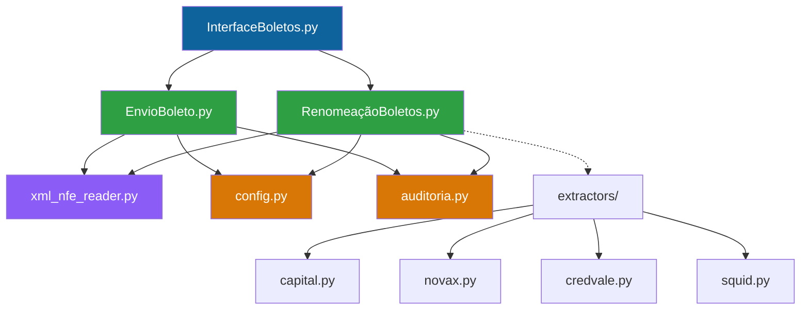

# Estrutura do projeto

Este documento descreve a arquitetura e organização do sistema de automação de boletos, facilitando o onboarding de novos desenvolvedores.

## Visão geral da arquitetura

### Propósito do sistema

Sistema automatizado para processamento e envio de boletos bancários para 4 FIDCs (Fundos de Investimento em Direitos Creditórios):

<CardGroup cols={2}>
  <Card title="Capital RS" icon="building" color="#0e639c">
    CAPITAL RS FIDC NP MULTISSETORIAL
  </Card>
  <Card title="Novax" icon="landmark" color="#107c10">
    Novax Fundo de Invest. Em Dir. Cred.
  </Card>
  <Card title="Credvale" icon="credit-card" color="#d83b01">
    CREDVALE FUNDO DE INVESTIMENTO EM DIREITOS CREDITORIOS MULTISSETORIAL (chamado internamente de Credit Valley)
  </Card>
  <Card title="Squid" icon="wallet" color="#8764b8">
    SQUID FUNDO DE INVESTIMENTO EM DIREITOS CREDITORIOS
  </Card>
</CardGroup>

### Tecnologias utilizadas

- **Python 3.x** - Linguagem principal
- **Tkinter** - Interface gráfica (GUI)
- **pdfplumber** - Extração de dados de PDFs
- **pywin32** - Integração com Microsoft Outlook
- **openpyxl** - Manipulação de planilhas Excel
- **xml.etree.ElementTree** - Parsing de XMLs NFe

### Fluxo principal

```
1. ENTRADA → Boletos PDF colocados na pasta BoletosEntrada
2. RENOMEAÇÃO → Sistema extrai dados e renomeia arquivos
3. VALIDAÇÃO → Validação em 5 camadas (XML → CNPJ → Nome → Valor → Email)
4. ENVIO → Emails criados no Outlook com boletos e notas fiscais anexadas
```

## Estrutura de pastas

### Servidor (ambiente do operador)

Esta é a estrutura que o operador encontra no servidor de produção:

```
[Pasta no Servidor]/
├── Auditoria/                   # Relatórios de auditoria
├── Boletos/                     # [VERIFICAR: equivale a BoletosEntrada? Ou outra função?]
├── Erros/                       # Logs de erros
├── Notas/                       # XMLs das notas fiscais
├── assinatura                   # Arquivo JPG (46 KB) — assinatura do e-mail
├── Como Usar                    # Documento de texto (11 KB) — manual do operador
└── SistemaBoletosJotaJota       # Aplicativo executável (~36 MB)
```

<Note>
A pasta "Boletos/" no servidor pode ter estrutura interna diferente das pastas de desenvolvimento (BoletosEntrada, BoletosRenomeados, BoletosEnviados). O executável pode gerenciar subpastas internamente.
</Note>

<Note>
[VERIFICAR: a assinatura usada em produção é o arquivo `assinatura.jpg` na raiz da pasta (visível no servidor) ou o `Outros/boletosTeste (temporario)/Imagem1.jpg` referenciado no código? Se o caminho de produção for diferente do de desenvolvimento, documentar ambos.]
</Note>

### Raiz (desenvolvimento)

Pasta principal para desenvolvimento e testes locais:

```
BoletosAutomação/
├── .gitignore                           # Controle de versão Git
├── .claude/                             # Assistente IA usado no desenvolvimento
├── .venv/                               # Virtual environment (principal)
├── venv/                                # Virtual environment (duplicata)
│
├── config.py                            # Configuração centralizada
├── InterfaceBoletos.py                  # Interface gráfica principal
├── RenomeaçãoBoletos.py                 # Script de renomeação
├── EnvioBoleto.py                       # Script de envio
├── xml_nfe_reader.py                    # Parser de XMLs NFe
├── auditoria.py                         # Sistema de logs e relatórios
├── requirements.txt                     # Dependências Python
│
├── Abrir_Interface.py                   # [VERIFICAR: wrapper para executar InterfaceBoletos.py?]
├── Abrir_Sistema.bat                    # Script batch para iniciar o sistema
├── COMO_ABRIR                           # Instruções de abertura (3 KB)
├── COMO_MOVER_PARA_SERVIDOR.py          # Script de deploy (7 KB)
├── COMO_USAR.py                         # Instruções de uso em código (11 KB)
│
├── auditoria_20251030_171229.json       # Exemplo de log de auditoria
│
├── BoletosEntrada/                      # Pasta de entrada (boletos originais)
├── BoletosEntrada_Backup/               # [VERIFICAR: backup automático antes de processar?]
├── BoletosRenomeados/                   # Boletos após renomeação
├── BoletosEnviados/                     # Boletos já enviados
├── Notas/                               # XMLs das notas fiscais
├── Auditoria/                           # Relatórios de auditoria
├── Erros/                               # Logs de erros
├── Logs/                                # [VERIFICAR: logging de runtime vs Auditoria/ (relatórios) vs Erros/ (rejeições)?]
├── Outros/                              # Arquivos auxiliares
│
├── _backups/                            # [VERIFICAR: backup manual ou automático? De quê?]
├── config/                              # [VERIFICAR: configurações adicionais? Templates? Credenciais?]
├── docs/                                # [VERIFICAR: documentação interna? Specs? Anotações?]
├── src/                                 # [VERIFICAR: código-fonte adicional? Módulos auxiliares?]
├── Python- automação/                   # [VERIFICAR: scripts auxiliares? Versão anterior?]
└── testenovax.cred.capital.squid/       # [VERIFICAR: pasta de testes por FIDC? Boletos de exemplo?]
```

### _build_server (produção)

Pasta otimizada para geração do executável (.exe) e deploy em servidor:

```
_build_server/
├── config_server.py             # Configuração para produção
├── InterfaceBoletos.py          # Interface (cópia)
├── RenomeaçãoBoletos.py         # Renomeação (cópia)
├── EnvioBoleto.py               # Envio (cópia)
├── xml_nfe_reader.py            # Parser XML (cópia)
├── auditoria.py                 # Auditoria (cópia)
├── extractors/                  # Extratores específicos por FIDC
│   ├── __init__.py
│   ├── base.py                  # Classe base
│   ├── capital.py               # Extrator Capital RS
│   ├── novax.py                 # Extrator Novax
│   ├── credvale.py              # Extrator Credvale
│   └── squid.py                 # Extrator Squid
├── tests/                       # Testes unitários
├── build_sistema.spec           # Configuração PyInstaller
└── gerar_exe.bat                # Script para gerar .exe
```

**Diferenças principais:**
- `config_server.py` usa caminhos de rede (ex: `\\SERVIDOR\Compartilhado\`)
- Pasta `extractors/` com extratores modulares por FIDC
- Testes unitários para garantir qualidade
- Scripts de build automatizado

<Note>
[VERIFICAR: a raiz de desenvolvimento usa regex inline no RenomeaçãoBoletos.py enquanto _build_server refatorou para o padrão de extratores modulares? Se sim, explicar: "O ambiente de desenvolvimento mantém a lógica de extração dentro do RenomeaçãoBoletos.py. A pasta _build_server refatorou essa lógica em extratores modulares (um por FIDC) usando o padrão Factory. A versão _build_server é a que gera o executável de produção."]
</Note>

### Pasta Outros/

Arquivos auxiliares e temporários:
- Planilhas de controle (Excel)
- Imagens de assinatura de email
- Arquivos de teste

## Arquivos de configuração

### config.py vs config_server.py

<Tabs>
  <Tab title="Desenvolvimento">
    **config.py** - Ambiente local de desenvolvimento:
    ```python
    BASE_DIR = r"C:\Users\User-OEM\Desktop\BoletosAutomação"
    ```
  </Tab>
  <Tab title="Produção">
    **config_server.py** - Ambiente de servidor:
    ```python
    BASE_DIR = r"\\SERVIDOR\Compartilhado\BoletosAutomação"
    ```
  </Tab>
</Tabs>

<Note>
[VERIFICAR: o domínio correto dos e-mails é `jj.net.br` ou `jotajota.net.br`? A entrevista com a operadora usa `jj.net.br`, a documentação existente usa `jotajota.net.br`. Confirmar com a equipe e padronizar em toda a documentação.]
</Note>

### Configuração dos 4 FIDCs

Cada FIDC possui configuração específica em `FIDC_CONFIG`:

```python
FIDC_CONFIG = {
    "CAPITAL": {
        "nome": "CAPITAL",
        "nome_completo": "CAPITAL RS FIDC NP MULTISSETORIAL",
        "cnpj": "12.910.463/0001-70",
        "cc_emails": ["adm@jotajota.net.br"],
        "palavras_chave": ["CAPITAL RS", "CAPITAL RS FIDC"],
        "cor": "#0e639c"
    },
    # ... outros FIDCs
}
```

### Flags operacionais

```python
MODO_PREVIEW = True              # True = abre emails sem enviar
USAR_PLANILHA = False            # Sistema usa XMLs (não planilha)
USAR_IA = False                  # IA desabilitada (usa Regex)
VALIDACAO_CNPJ_OBRIGATORIA = True
TOLERANCIA_VALOR_CENTAVOS = 0    # Tolerância ZERO
MAX_EMAILS_POR_CLIENTE = 2       # Máximo de emails válidos
```

<Warning>
**MODO_PREVIEW = True**: Esta flag está True desde a fase de testes e não foi revertida após a saída do desenvolvedor original. Com True, o sistema abre e-mails no Outlook para envio manual ao invés de enviar automaticamente. Mudar para False ativa o envio automático — só faça isso após validação completa com a equipe de cobrança.
</Warning>

<Note>
**USAR_PLANILHA = False**: Versões anteriores testaram extração de dados via planilha Excel. Descartada em favor de XMLs, que são a fonte primária de dados no sistema Viasoft (ERP da JJ).
</Note>

<Note>
**USAR_IA = False**: Versões anteriores testaram extração via IA. Descartada em favor de Regex, que se mostrou 100% funcional para os layouts conhecidos dos 4 FIDCs.
</Note>

### requirements.txt

Principais dependências:
```
pdfplumber==0.11.7      # Extração de PDFs
pywin32==311            # Integração Outlook
openpyxl==3.1.5         # Planilhas Excel
Unidecode==1.4.0        # Normalização de texto
pytest==8.4.2           # Testes unitários
```

## Principais módulos

### Diagrama de dependências



<Note>
Os extratores modulares (linha pontilhada) existem apenas na versão _build_server. [VERIFICAR se a raiz usa extractors ou regex inline.]
</Note>

### InterfaceBoletos.py

Interface gráfica moderna (Dark Theme) com Tkinter.

**Funcionalidades:**
- Seleção de FIDC (4 botões coloridos)
- Botões de ação (Renomear / Enviar)
- Status em tempo real (XMLs, boletos, planilha)
- Log de execução com cores
- Edição de emails CC por FIDC (duplo clique)

**Componentes principais:**
```python
class InterfaceBoletos:
    def selecionar_fidc(fidc_key)      # Seleciona FIDC
    def renomear_boletos()              # Executa renomeação
    def enviar_boletos()                # Executa envio
    def mostrar_popup_resumo(count)     # Confirmação antes de enviar
```

### RenomeaçãoBoletos.py

Extração de dados de PDFs e renomeação automática.

**Funcionalidades:**
- Extração via Regex (100% funcional)
- Suporte para 4 FIDCs (extratores específicos)
- Extração de número da nota (do boleto ou XML)
- Matching inteligente com XMLs NFe
- Validação cruzada (boleto ↔ XML)

**Fluxo de extração:**
```python
def extrair_dados(texto: str):
    # 1. Detectar FIDC
    fidc = detectar_fidc(texto)
    
    # 2. Extrair dados básicos (Regex por FIDC)
    pagador, vencimento, valor = extrair_dados_regex(texto)
    
    # 3. Extrair CNPJ do boleto
    cnpj = extrair_cnpj_do_boleto(texto)
    
    # 4. Obter número da nota (XML prioritário)
    numero_nf, dados_xml = obter_numero_nota(cnpj, valor, pagador, venc, texto, mapa_xmls)
    
    # 5. Gerar nome do arquivo
    novo_nome = f"{pagador} - {numero_nf} - {venc} - {valor}.pdf"
```

**Formato de saída:**
```
AREAIS DO LESTE SPE LTDA - NF 310227 - 13-01 - R$ 2.833,34.pdf
```

### EnvioBoleto.py

Validação em 5 camadas e envio via Outlook.

**Sistema de validação:**
```python
def validar_boleto_com_xml(numero_nota, pagador, valor, cnpj, mapa_xmls):
    # CAMADA 1: Buscar XML correspondente
    # CAMADA 2: Validar CNPJ (boleto vs XML)
    # CAMADA 3: Validar Nome (fuzzy matching ≥85%)
    # CAMADA 4: Validar Valor (tolerância 0 centavos)
    # CAMADA 5: Validar Emails (completos e válidos)
```

**Fluxo de envio:**
```python
def executar():
    # 1. Carregar XMLs das notas fiscais
    mapa_xmls = carregar_dados_xmls()
    
    # 2. Processar cada boleto
    for boleto in boletos:
        # 2.1. Extrair CNPJ e FIDC do PDF
        cnpj = extrair_cnpj_do_pdf(boleto)
        fidc = detectar_fidc_do_pdf(boleto)
        
        # 2.2. Validar em 5 camadas
        dados_xml, status = validar_boleto_com_xml(...)
        
        # 2.3. Agrupar por cliente
        grupos[email].append(boleto)
    
    # 3. Enviar emails agrupados
    for grupo in grupos:
        abrir_email_outlook(...)
```

### xml_nfe_reader.py

Parser de XMLs de Nota Fiscal Eletrônica (NFe).

**Funcionalidades:**
- Extração de emails do destinatário (máx. 2 válidos)
- Validação de emails completos (sem truncamento)
- Extração de CNPJ, nome, número da nota, valor
- Suporte a duplicatas (parcelas)

**Estrutura de dados retornada:**
```python
{
    'xml_valido': True,
    'numero_nota': '310227',
    'cnpj': '54737141000110',
    'nome': 'AREAIS DO LESTE SPE LTDA',
    'valor_total': Decimal('2833.34'),
    'emails': ['compras@dacampos.com.br', 'financeiro@dacampos.com.br'],
    'emails_invalidos': ['teste@gmail.'],  # Filtrados
    'duplicatas': [
        {'numero': '001', 'vencimento': '2026-01-13', 'valor': Decimal('2833.34')}
    ]
}
```

### auditoria.py

Sistema profissional de logs e relatórios.

**Funcionalidades:**
- Registro detalhado de cada operação
- Rastreabilidade completa (timestamps, checksums)
- Relatórios separados (aprovados / rejeitados)
- Formato TXT (legível) e JSON (estruturado)

**Relatórios gerados:**
```
Auditoria/
├── auditoria_aprovados_20250203_143022.txt   # Boletos enviados
├── auditoria_20250203_143022.json            # Dados estruturados
└── erros_criticos_20250203.log               # Log de erros

Erros/
└── erros_20250203_143022.txt                 # Boletos rejeitados
```

### extractors/ (pasta)

Extratores modulares específicos por FIDC (apenas em `_build_server/`).

**Estrutura:**
```python
# base.py - Classe abstrata
class BoletoExtractor(ABC):
    @abstractmethod
    def extrair_pagador(texto: str) -> str
    
    @abstractmethod
    def extrair_vencimento(texto: str) -> str
    
    @abstractmethod
    def extrair_valor(texto: str) -> str

# capital.py, novax.py, credvale.py, squid.py
class CapitalExtractor(BoletoExtractor):
    def extrair_pagador(texto: str):
        # Lógica específica para Capital RS
```

**Factory pattern:**
```python
# factory.py
def criar_extrator(fidc: str) -> BoletoExtractor:
    if fidc == "CAPITAL":
        return CapitalExtractor()
    elif fidc == "NOVAX":
        return NovaxExtractor()
    # ...
```

## Sistema de validação em 5 camadas

### Camada 1: XML

Busca o XML correspondente ao número da nota extraído do boleto.

**Validação:**
- XML existe e é válido
- Número da nota é exatamente igual

**Resultado:**
- ✅ Aprovado: XML encontrado e válido
- ❌ Rejeitado: XML não encontrado ou inválido

### Camada 2: CNPJ

Compara CNPJ extraído do boleto com CNPJ do XML.

**Validação:**
- CNPJ do boleto == CNPJ do XML (14 dígitos)

**Resultado:**
- ✅ Aprovado: CNPJs idênticos
- ❌ Rejeitado: CNPJs divergentes
- ⚠️ Aviso: CNPJ não disponível (continua)

### Camada 3: Nome

Compara nome do pagador (boleto vs XML) usando fuzzy matching.

**Validação:**
- Similaridade ≥ 85% (SequenceMatcher)

**Resultado:**
- ✅ Aprovado: Similaridade ≥ 85%
- ⚠️ Aviso: Similaridade < 85% (aceita mesmo assim)

### Camada 4: Valor

Compara valor do boleto com valor do XML (total ou duplicata).

**Validação:**
- Diferença ≤ 0 centavos (tolerância ZERO)
- Prioriza valor da duplicata (se match por vencimento)

**Resultado:**
- ✅ Aprovado: Valores idênticos
- ❌ Rejeitado: Diferença > 0 centavos
- ⚠️ Aviso: Valor não disponível (continua)

### Camada 5: Email

Valida emails extraídos do XML.

**Validação:**
- Pelo menos 1 email válido
- Email completo (não truncado)
- Formato válido (regex)

**Resultado:**
- ✅ Aprovado: Emails válidos encontrados
- ❌ Rejeitado: Nenhum email válido

## Convenções de nomenclatura

### Padrão de nomes de boletos renomeados

**Formato:**
```
{PAGADOR} - NF {NUMERO_NOTA} - {VENCIMENTO} - {VALOR}.pdf
```

**Exemplo:**
```
AREAIS DO LESTE SPE LTDA - NF 310227 - 13-01 - R$ 2.833,34.pdf
```

**Componentes:**
- `PAGADOR`: Nome normalizado (sem CNPJ, sem caracteres especiais)
- `NF {NUMERO_NOTA}`: Número da nota fiscal (6 dígitos)
- `VENCIMENTO`: Formato DD-MM
- `VALOR`: Formato R$ X.XXX,XX

### Estrutura de pastas operacionais

```
BoletosAutomação/
├── BoletosEntrada/      # Boletos originais (entrada)
├── BoletosRenomeados/   # Boletos após renomeação (processamento)
├── BoletosEnviados/     # Boletos já enviados (arquivo)
├── Notas/               # XMLs das notas fiscais
├── Auditoria/           # Relatórios de sucesso
└── Erros/               # Relatórios de erros
```

## Como executar o sistema

### Modo desenvolvimento (Python)

**Pré-requisitos:**
```bash
# Instalar Python 3.8 ou superior
# Instalar dependências
pip install -r requirements.txt
```

**Criar pastas operacionais (se não existirem):**
```bash
mkdir BoletosEntrada BoletosRenomeados BoletosEnviados Notas Auditoria Erros Logs
```

<Note>
Estas pastas provavelmente estão no `.gitignore` e não são criadas automaticamente ao clonar o repositório.
</Note>

**Executar interface:**
```bash
python InterfaceBoletos.py
```

**Executar scripts diretamente:**
```bash
# Renomear boletos
python RenomeaçãoBoletos.py

# Enviar boletos
python EnvioBoleto.py
```

**Executar testes:**
```bash
pytest _build_server/tests/
```

<Note>
[VERIFICAR: os testes estão apenas em `_build_server/tests/` ou também há testes na raiz? A pasta `testenovax.cred.capital.squid/` na raiz contém testes ou dados de teste?]
</Note>

### Modo produção (.exe)

**Gerar executável:**
```bash
cd _build_server
gerar_exe.bat
```

**Executar sistema:**
```
# Duplo clique no atalho ou
SistemaBoletosJotaJota.exe
```

<Note>
O executável tem aproximadamente 36 MB de tamanho.
</Note>

**Configuração para servidor:**
1. Copiar pasta `BoletosAutomação` para servidor
2. Editar `config_server.py`:
   ```python
   BASE_DIR = r"\\SERVIDOR\Compartilhado\BoletosAutomação"
   ```
3. Gerar novo .exe com configuração de servidor
4. Criar atalho para usuários

### Dependências necessárias

**Python:**
- Python 3.8 ou superior

**Bibliotecas principais:**
- `pdfplumber` - Extração de PDFs
- `pywin32` - Integração com Outlook
- `openpyxl` - Manipulação de Excel
- `tkinter` - Interface gráfica (incluído no Python)

**Software externo:**
- Microsoft Outlook (instalado e configurado)
- Conta de email: `cobranca@jotajota.net.br` [VERIFICAR: ou `cobranca@jj.net.br`?]

**Estrutura de pastas:**
- Todas as pastas operacionais devem existir
- XMLs das notas fiscais na pasta `Notas/`
- Imagem de assinatura em `Outros/boletosTeste (temporario)/Imagem1.jpg` (desenvolvimento) ou `assinatura.jpg` na raiz (produção)
