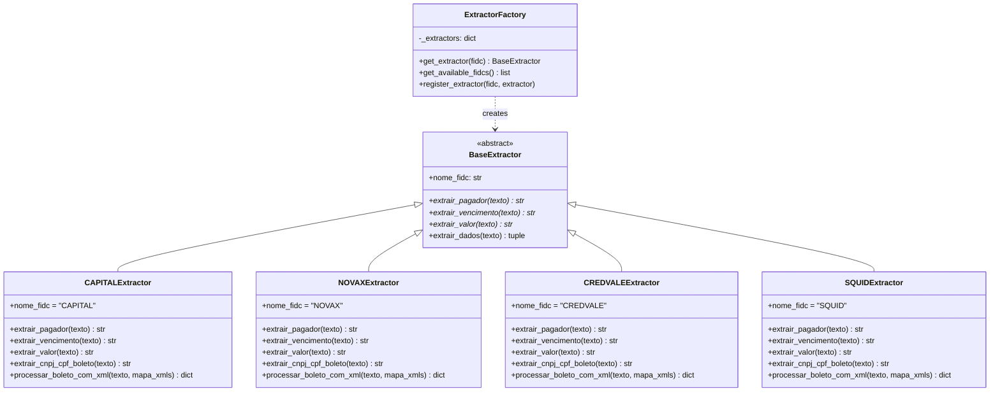

# Extratores por FIDC

Este documento detalha a lógica de extração de dados de boletos PDF para cada uma das 4 FIDCs, incluindo os padrões regex utilizados, peculiaridades de layout e edge cases.

## Arquitetura dos extratores

### Visão geral

O sistema utiliza **extratores modulares** na pasta `_build_server/extractors/`, implementando o padrão **Factory** para seleção automática do extrator correto baseado no FIDC detectado.



### Classe base (BaseExtractor)

Todos os extratores herdam de `BaseExtractor` e devem implementar 3 métodos obrigatórios:

```python
from abc import ABC, abstractmethod

class BaseExtractor(ABC):
    @property
    @abstractmethod
    def nome_fidc(self) -> str:
        """Nome do FIDC (CAPITAL, NOVAX, CREDVALE, SQUID)"""
        pass

    @abstractmethod
    def extrair_pagador(self, texto: str) -> str:
        """Extrai nome do pagador do PDF"""
        pass

    @abstractmethod
    def extrair_vencimento(self, texto: str) -> str:
        """Extrai vencimento no formato DD-MM"""
        pass

    @abstractmethod
    def extrair_valor(self, texto: str) -> str:
        """Extrai valor no formato R$ X.XXX,XX"""
        pass
```

### Factory Pattern

O `ExtractorFactory` seleciona automaticamente o extrator correto:

```python
from extractors import ExtractorFactory

# Uso
fidc = "CAPITAL"
extractor = ExtractorFactory.get_extractor(fidc)
pagador, vencimento, valor = extractor.extrair_dados(texto_pdf)
```

<Note>
**Diferença raiz vs _build_server**: A raiz de desenvolvimento (`RenomeaçãoBoletos.py`) usa regex inline dentro de funções específicas por FIDC. A pasta `_build_server/extractors/` refatorou essa lógica em classes modulares usando o padrão Factory. A versão `_build_server` é a que gera o executável de produção.
</Note>

## Extratores por FIDC

<Tabs>
  <Tab title="Capital RS">
    ### Extrator CAPITAL RS

    **Características do layout:**
    - Usa formato **DANFE** (Nota Fiscal Eletrônica)
    - Campo `DESTINATÁRIO/REMETENTE` para pagador
    - Seção `FATURA` com número, vencimento e valor
    - Suporta CPF e CNPJ

    #### Regex: Pagador

    **Tentativa 1 - DANFE (prioritária):**
    ```python
    # Busca seção "DESTINATÁRIO/REMETENTE"
    # Próxima linha: "NOME/RAZÃO SOCIAL"
    # Linha seguinte: nome do destinatário
    
    for i, linha in enumerate(linhas):
        if "DESTINAT" in linha.upper() and "REMETENTE" in linha.upper():
            if i + 2 < len(linhas):
                linha_nome = linhas[i + 2].strip()
                if "CNPJ" not in linha_nome and "CPF" not in linha_nome:
                    pagador = self._limpar_nome(linha_nome)
    ```

    **Tentativa 2 - Boleto tradicional (fallback):**
    ```python
    # Busca campo "Pagador" em linha separada
    for i, linha in enumerate(linhas):
        if "PAGADOR" in linha.upper():
            if i + 1 < len(linhas):
                pagador = linhas[i + 1].strip()
    ```

    #### Regex: Vencimento

    ```python
    # Padrão: DD/MM/YYYY
    # Retorna: DD-MM
    
    for i, linha in enumerate(linhas):
        if "VENCIMENTO" in linha.upper():
            match = re.search(r'(\d{2})/(\d{2})/\d{4}', linha)
            if match:
                return f"{match.group(1)}-{match.group(2)}"
    ```

    #### Regex: Valor

    **Padrão 0 - Seção FATURA (DANFE, mais confiável):**
    ```python
    # Formato:
    # FATURA
    # NÚMERO VENCIMENTO VALOR
    # 001    DD/MM/YYYY  X.XXX,XX
    
    match_fatura = re.search(
        r'FATURA.*?[\r\n]+.*?[\r\n]+\s*\d{3}\s+\d{2}/\d{2}/\d{4}\s+(\d{1,3}(?:\.\d{3})*,\d{2})(?:\s|$)',
        texto,
        re.IGNORECASE | re.DOTALL
    )
    ```

    **Padrão 1 - Valor Documento:**
    ```python
    padroes = [
        r'\(=\)\s*Valor\s+(?:do\s+)?Documento\s*[:\s]*(?:R\$\s*)?([\\d\.\,]+)',
        r'Valor\s+(?:do\s+)?Documento\s*[:\s]*(?:R\$\s*)?([\\d\.\,]+)',
    ]
    ```

    **Padrão 2 - Linha com estrutura "número_doc data valor":**
    ```python
    # Formato: 310926/004 17/02/2026 2.221,20
    match = re.search(r'\d{6}[/\d]*\s+\d{2}/\d{2}/\d{4}\s+([\d\.\,]+)', texto)
    ```

    **Padrão 3 - Código de barras (último recurso):**
    ```python
    # Extrai valor das posições 37-47 do código de barras
    match = re.search(
        r'\d{5}\.\d{5}\s+\d{5}\.\d{6}\s+\d{5}\.\d{6}\s+\d\s+(\d{14})',
        texto
    )
    if match:
        codigo_completo = match.group(1)
        valor_cents_str = codigo_completo[3:13]  # Posições 3-13
        valor_cents = int(valor_cents_str)
        valor_reais = valor_cents / 100
    ```

    #### Regex: CNPJ/CPF

    ```python
    # Busca após "DESTINATÁRIO/REMETENTE"
    # Padrão CPF: XXX.XXX.XXX-XX
    match_cpf = re.search(r'(\d{3}\.\d{3}\.\d{3}-\d{2})', linha_busca)
    
    # Padrão CNPJ: XX.XXX.XXX/XXXX-XX
    match_cnpj = re.search(r'(\d{2}\.\d{3}\.\d{3}/\d{4}-\d{2})', linha_busca)
    ```

    #### Regex: Número da Nota

    ```python
    # Padrão DANFE: "NÚMERO DA NOTA ... 310018"
    for i, linha in enumerate(linhas):
        if 'MERO DA NOTA' in linha.upper():
            for j in range(i, min(i + 4, len(linhas))):
                match = re.search(r'0?(\d{6})', linhas[j])
    
    # Padrão Boleto: "Número do Documento ... 310018/001"
    # Retorna apenas 310018 (sem /001)
    match = re.search(r'0?(\d{6})(?:/\d{3})?', linha_check)
    ```

    #### Peculiaridades

    - **DANFE vs Boleto tradicional**: Capital RS pode usar ambos os formatos
    - **Seção FATURA**: Mais confiável que "Valor Documento" para DANFEs
    - **Número da nota**: Pode vir com ou sem zero à esquerda (0310018 vs 310018)
    - **Duplicatas**: Suporta múltiplas parcelas com vencimentos diferentes

    <Accordion title="Exemplo de texto extraído (Capital RS)">
    ```
    DESTINATÁRIO/REMETENTE
    NOME/RAZÃO SOCIAL
    AREAIS DO LESTE SPE LTDA
    CNPJ/CPF: 54.737.141/0001-10
    
    FATURA
    NÚMERO VENCIMENTO VALOR
    001    13/01/2026  2.833,34
    
    NÚMERO DA NOTA
    310227
    ```
    </Accordion>
  </Tab>

  <Tab title="Novax">
    ### Extrator NOVAX

    **Características do layout:**
    - Formato de **boleto tradicional** (não é DANFE)
    - Campo `Pagador:` seguido do nome na mesma linha
    - Padrão: `Pagador: NOME CNPJ/ CPF : XX.XXX.XXX/XXXX-XX`

    #### Regex: Pagador

    **Padrão principal (texto compacto):**
    ```python
    # Compactar texto (remover quebras de linha)
    compacto = re.sub(r'\s+', ' ', texto).strip()
    
    # Busca "Pagador:" seguido do nome até CNPJ/CPF
    match = re.search(
        r'Pagador:\s*([A-Z0-9][A-Z0-9\s\.\-&]+?)(?:\s+CNPJ[/\s]|\s+CPF)',
        compacto,
        re.IGNORECASE
    )
    ```

    **Fallback (linhas separadas):**
    ```python
    for i, linha in enumerate(linhas):
        if "PAGADOR" in linha.upper():
            if i + 1 < len(linhas):
                pagador = linhas[i + 1].strip()
    ```

    #### Regex: Vencimento

    ```python
    # Mesmo padrão de Capital RS
    # Busca "VENCIMENTO" seguido de DD/MM/YYYY
    for i, linha in enumerate(linhas):
        if "VENCIMENTO" in linha.upper():
            match = re.search(r'(\d{2})/(\d{2})/\d{4}', linha)
    ```

    #### Regex: Valor

    **Ordem de prioridade:**
    1. Campo "Valor Documento"
    2. Linha com data + valor
    3. Qualquer R$ seguido de valor válido
    4. Código de barras

    ```python
    # Padrão 1: Valor Documento
    padroes = [
        r'\(=\)\s*Valor\s+(?:do\s+)?Documento\s*[:\s]*(?:R\$\s*)?([\\d\.\,]+)',
        r'Valor\s+(?:do\s+)?Documento\s*[:\s]*(?:R\$\s*)?([\\d\.\,]+)',
    ]
    
    # Padrão 2: Data + valor
    match = re.search(r'\d{2}/\d{2}/\d{4}\s+([\d\.\,]+)', texto)
    ```

    #### Regex: CNPJ/CPF

    ```python
    # Busca após "PAGADOR"
    # Padrão CPF: XXX.XXX.XXX-XX
    match_cpf = re.search(r'(\d{3}\.\d{3}\.\d{3}-\d{2})', linha_busca)
    
    # Padrão CNPJ: XX.XXX.XXX/XXXX-XX
    match_cnpj = re.search(r'(\d{2}\.\d{3}\.\d{3}/\d{4}-\d{2})', linha_busca)
    
    # Fallback: buscar em qualquer lugar
    match_cnpj = re.search(r'CNPJ[:\s]*(\d{2}\.\d{3}\.\d{3}/\d{4}-\d{2})', texto)
    ```

    #### Regex: Número da Nota

    ```python
    # Padrão: "Número do Documento ... 305815/001"
    for i, linha in enumerate(linhas):
        if 'MERO DO DOCUMENTO' in linha.upper():
            for j in range(i, min(i + 4, len(linhas))):
                # Retorna apenas 305815 (sem /001)
                match = re.search(r'0?(\d{6})(?:/\d{3})?', linhas[j])
    ```

    #### Peculiaridades

    - **Texto compacto**: Regex funciona melhor com texto em linha única
    - **"CNPJ/ CPF"**: Espaço entre CNPJ e barra é comum no layout Novax
    - **Pagador na mesma linha**: Diferente de outros FIDCs que usam linhas separadas
    - **Formato consistente**: Novax tem layout mais padronizado que outros FIDCs

    <Accordion title="Exemplo de texto extraído (Novax)">
    ```
    Pagador: EMPRESA EXEMPLO LTDA CNPJ/ CPF : 12.345.678/0001-90
    
    Vencimento: 15/02/2026
    
    Número do Documento
    305815/001
    
    (=) Valor Documento: 1.500,00
    ```
    </Accordion>
  </Tab>

  <Tab title="Credvale">
    ### Extrator CREDVALE

    **Características do layout:**
    - Formato de **boleto tradicional**
    - Campo `Pagador` em linha **exata** (sem dois pontos)
    - Padrão: linha "Pagador" seguida do nome na próxima linha
    - Pode ter "- EPP -" antes do CNPJ (sem palavra "CNPJ")

    #### Regex: Pagador

    **Tentativa 1 - Linha "Pagador" exata:**
    ```python
    # Busca linha que contém APENAS "Pagador"
    for i, linha in enumerate(linhas):
        if linha.strip() == "Pagador":
            if i + 1 < len(linhas):
                linha_pagador = linhas[i + 1].strip()
                # Valida que não é código de barras
                if not re.match(r'^\d{5}\.\d{5}\s+\d{5}', linha_pagador):
                    pagador = self._limpar_nome(linha_pagador)
    ```

    **Tentativa 2 - Regex alternativo:**
    ```python
    # Padrão: "Pagador\n NOME - CNPJ"
    match = re.search(
        r'Pagador\s*\n\s*([A-ZÀ-Ú][A-ZÀ-Ú\s\.\-&]+?)\s*-\s*(?:CNPJ|CPF)',
        texto,
        re.IGNORECASE | re.MULTILINE
    )
    ```

    **Tentativa 3 - Texto compacto (fallback):**
    ```python
    compacto = re.sub(r'\s+', ' ', texto).strip()
    match = re.search(
        r'Pagador:\s*([A-Z0-9][A-Z0-9\s\.\-&]+?)(?:\s+CNPJ[/\s]|\s+CPF)',
        compacto,
        re.IGNORECASE
    )
    ```

    #### Regex: Vencimento

    ```python
    # Mesmo padrão dos outros FIDCs
    for i, linha in enumerate(linhas):
        if "VENCIMENTO" in linha.upper():
            match = re.search(r'(\d{2})/(\d{2})/\d{4}', linha)
    ```

    #### Regex: Valor

    **Mesma lógica de Novax:**
    1. Campo "Valor Documento"
    2. Linha com data + valor
    3. Qualquer R$ seguido de valor válido
    4. Código de barras

    ```python
    # Padrão 1: Valor Documento
    padroes = [
        r'\(=\)\s*Valor\s+(?:do\s+)?Documento\s*[:\s]*(?:R\$\s*)?([\\d\.\,]+)',
        r'Valor\s+(?:do\s+)?Documento\s*[:\s]*(?:R\$\s*)?([\\d\.\,]+)',
    ]
    ```

    #### Regex: CNPJ/CPF

    ```python
    # Busca após "PAGADOR" ou linha "Pagador"
    for i, linha in enumerate(linhas):
        if "PAGADOR" in linha.upper() or linha.strip() == "Pagador":
            for j in range(i, min(i + 5, len(linhas))):
                # CPF
                match_cpf = re.search(r'(\d{3}\.\d{3}\.\d{3}-\d{2})', linhas[j])
                # CNPJ
                match_cnpj = re.search(r'(\d{2}\.\d{3}\.\d{3}/\d{4}-\d{2})', linhas[j])
    ```

    #### Regex: Número da Nota

    ```python
    # Padrão: "Número do Documento ... 310922/003"
    for i, linha in enumerate(linhas):
        if 'MERO DO DOCUMENTO' in linha.upper():
            for j in range(i, min(i + 4, len(linhas))):
                # Retorna apenas 310922 (sem /003)
                match = re.search(r'0?(\d{6})/\d{3}', linhas[j])
    ```

    #### Peculiaridades

    - **Linha "Pagador" exata**: Sem dois pontos, diferente de outros FIDCs
    - **"- EPP -" antes do CNPJ**: Formato específico de Credvale para empresas EPP
    - **Sem palavra "CNPJ"**: Em alguns casos, CNPJ vem direto após "- EPP -"
    - **Validação de código de barras**: Necessária para evitar capturar linha errada

    <Accordion title="Exemplo de texto extraído (Credvale)">
    ```
    Pagador
    EMPRESA EXEMPLO LTDA - EPP - 12.345.678/0001-90
    
    Vencimento
    20/03/2026
    
    Número do Documento
    310922/003
    
    (=) Valor Documento
    3.450,75
    ```
    </Accordion>
  </Tab>

  <Tab title="Squid">
    ### Extrator SQUID

    **Características do layout:**
    - Usa formato **DANFE** (Nota Fiscal Eletrônica)
    - Seção `FATURA` com formato específico
    - Campo `DESTINATÁRIO/REMETENTE` para pagador
    - Suporta fallback para boleto tradicional

    #### Regex: Pagador

    **Tentativa 1 - DANFE (prioritária):**
    ```python
    # Busca seção "DESTINATÁRIO/REMETENTE"
    for i, linha in enumerate(linhas):
        if "DESTINAT" in linha.upper() and "REMETENTE" in linha.upper():
            if i + 2 < len(linhas):
                linha_nome = linhas[i + 2].strip()
                if "CNPJ" not in linha_nome and "CPF" not in linha_nome:
                    pagador = self._limpar_nome(linha_nome)
    ```

    **Tentativa 2 - Boleto tradicional:**
    ```python
    for i, linha in enumerate(linhas):
        if "PAGADOR" in linha.upper():
            if i + 1 < len(linhas):
                pagador = linhas[i + 1].strip()
    ```

    **Tentativa 3 - Regex alternativo:**
    ```python
    compacto = re.sub(r'\s+', ' ', texto).strip()
    match = re.search(
        r'Pagador:\s*([A-Z0-9][A-Z0-9\s\.\-&]+?)(?:\s+CNPJ[/\s]|\s+CPF)',
        compacto,
        re.IGNORECASE
    )
    ```

    #### Regex: Vencimento

    ```python
    # Mesmo padrão dos outros FIDCs
    for i, linha in enumerate(linhas):
        if "VENCIMENTO" in linha.upper():
            match = re.search(r'(\d{2})/(\d{2})/\d{4}', linha)
    ```

    #### Regex: Valor

    **Padrão 0 - Seção FATURA (DANFE SQUID, mais confiável):**
    ```python
    # Formato específico SQUID:
    # FATURA
    # NÚMERO VENCIMENTO VALOR
    # 001    DD/MM/YYYY  X.XXX,XX
    
    match_fatura = re.search(
        r'FATURA.*?[\r\n]+.*?[\r\n]+\s*\d{3}\s+\d{2}/\d{2}/\d{4}\s+(\d{1,3}(?:\.\d{3})*,\d{2})(?:\s|$)',
        texto,
        re.IGNORECASE | re.DOTALL
    )
    ```

    <Warning>
    **Bug corrigido v2.0**: Regex FATURA agora captura apenas o valor, sem concatenar o dia do vencimento. Versões anteriores podiam capturar "132.833,34" ao invés de "2.833,34".
    </Warning>

    **Padrões 1-5**: Mesmos de Capital RS (Valor Documento, linha com data, R$, código de barras)

    #### Regex: CNPJ/CPF

    ```python
    # Busca após "DESTINATÁRIO/REMETENTE"
    for i, linha in enumerate(linhas):
        if "DESTINAT" in linha.upper() and "REMETENTE" in linha.upper():
            for j in range(i + 1, min(i + 5, len(linhas))):
                # CPF
                match_cpf = re.search(r'(\d{3}\.\d{3}\.\d{3}-\d{2})', linhas[j])
                # CNPJ
                match_cnpj = re.search(r'(\d{2}\.\d{3}\.\d{3}/\d{4}-\d{2})', linhas[j])
    ```

    #### Regex: Número da Nota

    ```python
    # Padrão DANFE: "NÚMERO DA NOTA ... 305537"
    for i, linha in enumerate(linhas):
        if 'MERO DA NOTA' in linha.upper():
            for j in range(i, min(i + 4, len(linhas))):
                match = re.search(r'0?(\d{6})', linhas[j])
    
    # Padrão Boleto: "Número do Documento ... 305537/001"
    match = re.search(r'0?(\d{6})(?:/\d{3})?', linha_check)
    ```

    #### Método específico: Extrair NF do filename

    ```python
    @staticmethod
    def extrair_numero_nf_do_filename(filename: str) -> str:
        """
        Extrai número da NF do nome do arquivo SQUID
        
        Exemplos:
            "3-0305537.pdf" → "305537"
            "3-305537.xml" → "305537"
        """
        nome_arquivo = os.path.basename(filename)
        
        # Padrão 1: "3-0305537.pdf"
        match = re.search(r'\d+-0?(\d{6})\.', nome_arquivo)
        if match:
            return match.group(1)
        
        # Padrão 2: "305537.pdf"
        match = re.search(r'^0?(\d{6})\.', nome_arquivo)
        if match:
            return match.group(1)
    ```

    #### Peculiaridades

    - **Seção FATURA**: Formato específico de SQUID, diferente de Capital RS
    - **Bug de concatenação**: Versões antigas concatenavam dia do vencimento com valor
    - **Filename com prefixo**: Arquivos SQUID podem ter prefixo "3-" no nome
    - **DANFE prioritário**: Sempre tenta DANFE antes de boleto tradicional

    <Accordion title="Exemplo de texto extraído (Squid)">
    ```
    DESTINATÁRIO/REMETENTE
    NOME/RAZÃO SOCIAL
    EMPRESA EXEMPLO LTDA
    CNPJ: 12.345.678/0001-90
    
    FATURA
    NÚMERO VENCIMENTO VALOR
    001    13/01/2026  2.833,34
    
    NÚMERO DA NOTA
    305537
    ```
    </Accordion>
  </Tab>
</Tabs>

## Tabela comparativa

| Característica | Capital RS | Novax | Credvale | Squid |
|----------------|------------|-------|----------|-------|
| **Formato** | DANFE + Boleto | Boleto tradicional | Boleto tradicional | DANFE + Boleto |
| **Campo Pagador** | `DESTINATÁRIO/REMETENTE` | `Pagador:` (mesma linha) | `Pagador` (linha exata) | `DESTINATÁRIO/REMETENTE` |
| **Seção FATURA** | ✅ Sim | ❌ Não | ❌ Não | ✅ Sim (formato diferente) |
| **CNPJ sem palavra** | ❌ Não | ❌ Não | ✅ Sim ("- EPP -") | ❌ Não |
| **Número da Nota** | `NÚMERO DA NOTA` ou `Número do Documento` | `Número do Documento` | `Número do Documento` | `NÚMERO DA NOTA` ou `Número do Documento` |
| **Formato NF** | 310227 ou 0310227 | 305815/001 | 310922/003 | 305537 ou 0305537 |
| **Suporta CPF** | ✅ Sim | ✅ Sim | ✅ Sim | ✅ Sim |
| **Duplicatas** | ✅ Sim | ✅ Sim | ✅ Sim | ✅ Sim |
| **Fallbacks** | 6 padrões de valor | 4 padrões de valor | 4 padrões de valor | 6 padrões de valor |
| **Peculiaridade** | DANFE prioritário | Texto compacto | Linha "Pagador" exata | Bug de concatenação (corrigido v2.0) |

## Como criar um novo extrator

Se a JJ começar a trabalhar com uma 5ª FIDC, siga este passo a passo:

### Passo 1: Criar arquivo do extrator

Crie `_build_server/extractors/novo_fidc.py`:

```python
# ===============================================
# Extrator NOVO_FIDC - Código 100% Isolado
# ===============================================

import re
from typing import Optional
from .base import BaseExtractor

class NOVOFIDCExtractor(BaseExtractor):
    """
    Extrator EXCLUSIVO para boletos NOVO_FIDC
    
    Características do boleto NOVO_FIDC:
    - [Descrever formato: DANFE ou boleto tradicional]
    - [Descrever campos específicos]
    - [Descrever peculiaridades]
    """
    
    @property
    def nome_fidc(self) -> str:
        return "NOVO_FIDC"
    
    def extrair_pagador(self, texto: str) -> str:
        """
        Extrai pagador do boleto NOVO_FIDC
        
        [Descrever lógica específica]
        """
        linhas = texto.splitlines()
        
        # Implementar lógica de extração
        # Exemplo:
        for i, linha in enumerate(linhas):
            if "PAGADOR" in linha.upper():
                if i + 1 < len(linhas):
                    pagador = linhas[i + 1].strip()
                    pagador = self._limpar_nome(pagador)
                    if pagador:
                        return pagador
        
        return "SEM_PAGADOR"
    
    def extrair_vencimento(self, texto: str) -> str:
        """
        Extrai vencimento do boleto NOVO_FIDC
        
        Busca padrão DD/MM/YYYY e retorna DD-MM
        """
        linhas = texto.splitlines()
        
        for i, linha in enumerate(linhas):
            if "VENCIMENTO" in linha.upper():
                match = re.search(r'(\d{2})/(\d{2})/\d{4}', linha)
                if match:
                    return f"{match.group(1)}-{match.group(2)}"
        
        return "SEM_VENCIMENTO"
    
    def extrair_valor(self, texto: str) -> str:
        """
        Extrai valor do boleto NOVO_FIDC
        
        [Descrever ordem de prioridade dos padrões]
        """
        # PADRÃO 1: Valor Documento
        padroes = [
            r'\(=\)\s*Valor\s+(?:do\s+)?Documento\s*[:\s]*(?:R\$\s*)?([\\d\.\,]+)',
            r'Valor\s+(?:do\s+)?Documento\s*[:\s]*(?:R\$\s*)?([\\d\.\,]+)',
        ]
        
        for padrao in padroes:
            match = re.search(padrao, texto, re.IGNORECASE | re.MULTILINE)
            if match:
                valor_str = match.group(1)
                if re.match(r'\d{1,3}(?:\.\d{3})*,\d{2}', valor_str):
                    return f"R$ {valor_str}"
        
        return "SEM_VALOR"
    
    def _limpar_nome(self, nome: str) -> str:
        """Remove CNPJ/CPF e caracteres indesejados"""
        nome = re.split(r',|CNPJ|CPF', nome, maxsplit=1, flags=re.IGNORECASE)[0].strip()
        return nome.strip()
```

### Passo 2: Registrar no Factory

Edite `_build_server/extractors/factory.py`:

```python
# Adicionar import
from .novo_fidc import NOVOFIDCExtractor

class ExtractorFactory:
    _extractors = {
        "SQUID": SQUIDExtractor(),
        "CAPITAL": CAPITALExtractor(),
        "NOVAX": NOVAXExtractor(),
        "CREDVALE": CREDVALEExtractor(),
        "NOVO_FIDC": NOVOFIDCExtractor(),  # ← Adicionar aqui
    }
```

### Passo 3: Adicionar detecção de FIDC

Edite `RenomeaçãoBoletos.py` (ou arquivo equivalente):

```python
def detectar_fidc(texto: str) -> str:
    u = texto.upper()
    if "CAPITAL RS FIDC" in u or "CAPITAL RS" in u:
        return "CAPITAL"
    if "NOVAX" in u:
        return "NOVAX"
    if "CREDVALE" in u:
        return "CREDVALE"
    if "SQUID" in u:
        return "SQUID"
    if "NOVO_FIDC" in u:  # ← Adicionar aqui
        return "NOVO_FIDC"
    return "DESCONHECIDO"
```

### Passo 4: Criar testes

Crie `_build_server/tests/test_novo_fidc_extractor.py`:

```python
import pytest
from extractors.novo_fidc import NOVOFIDCExtractor

def test_extrair_pagador():
    extractor = NOVOFIDCExtractor()
    
    texto = """
    Pagador
    EMPRESA TESTE LTDA
    CNPJ: 12.345.678/0001-90
    """
    
    pagador = extractor.extrair_pagador(texto)
    assert pagador == "EMPRESA TESTE LTDA"

def test_extrair_vencimento():
    extractor = NOVOFIDCExtractor()
    
    texto = """
    Vencimento: 15/03/2026
    """
    
    vencimento = extractor.extrair_vencimento(texto)
    assert vencimento == "15-03"

def test_extrair_valor():
    extractor = NOVOFIDCExtractor()
    
    texto = """
    (=) Valor Documento: 1.500,00
    """
    
    valor = extractor.extrair_valor(texto)
    assert valor == "R$ 1.500,00"
```

### Passo 5: Executar testes

```bash
cd _build_server
pytest tests/test_novo_fidc_extractor.py -v
```

### Passo 6: Adicionar ao config.py

Edite `config.py` para adicionar configuração da nova FIDC:

```python
FIDC_CONFIG = {
    "CAPITAL": {...},
    "NOVAX": {...},
    "CREDVALE": {...},
    "SQUID": {...},
    "NOVO_FIDC": {  # ← Adicionar aqui
        "nome": "NOVO_FIDC",
        "nome_completo": "NOVO FIDC NOME COMPLETO",
        "cnpj": "XX.XXX.XXX/XXXX-XX",
        "cc_emails": ["adm@jotajota.net.br"],
        "palavras_chave": ["NOVO_FIDC", "NOVO FIDC"],
        "cor": "#FF5733"  # Cor para interface
    }
}
```

### Passo 7: Testar em produção

1. Gerar novo executável:
   ```bash
   cd _build_server
   gerar_exe.bat
   ```

2. Testar com boletos reais da nova FIDC

3. Validar extração de todos os campos

4. Verificar matching com XMLs

<Tip>
**Dica**: Comece copiando o extrator mais similar (Capital RS para DANFE, Novax para boleto tradicional) e adapte os regex conforme necessário. Teste com pelo menos 10 boletos reais antes de colocar em produção.
</Tip>

## Recursos adicionais

### Ferramentas úteis

- **Regex101**: https://regex101.com/ (testar regex online)
- **pdfplumber**: Biblioteca Python para extração de texto de PDFs
- **pytest**: Framework de testes unitários

### Documentação relacionada

- [Estrutura do Projeto](/automacao-de-boletos/estrutura-do-projeto) - Arquitetura geral do sistema
- [Contexto de Negócio](/automacao-de-boletos/contexto-de-negocio) - Por que o sistema existe

### Debugging

Para debugar extração de um boleto específico:

```python
# Adicionar prints no extrator
def extrair_pagador(self, texto: str) -> str:
    print(f"[DEBUG] Texto recebido (primeiros 500 chars):")
    print(texto[:500])
    
    linhas = texto.splitlines()
    print(f"[DEBUG] Total de linhas: {len(linhas)}")
    
    for i, linha in enumerate(linhas):
        if "PAGADOR" in linha.upper():
            print(f"[DEBUG] Linha {i}: {linha}")
            if i + 1 < len(linhas):
                print(f"[DEBUG] Próxima linha: {linhas[i + 1]}")
```

Executar com modo verbose:

```bash
python RenomeaçãoBoletos.py --verbose
```
