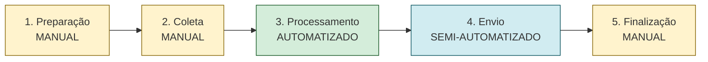
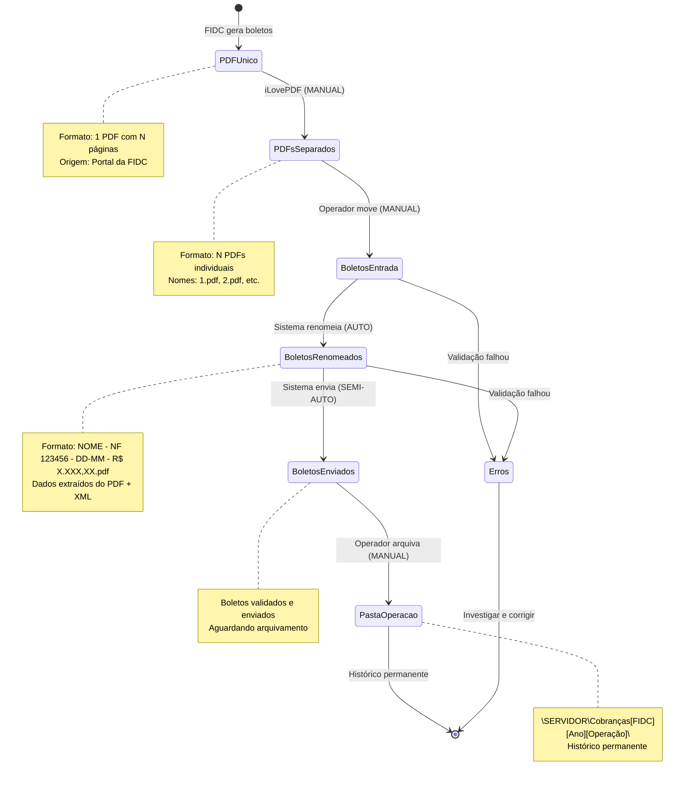

# Fluxo operacional completo

Este documento descreve o fluxo operacional completo do sistema de automação de boletos, desde a preparação inicial até o envio final e arquivamento.

## Visão geral das 5 fases



<Note>
**Legenda de cores:**
- 🟡 **Amarelo** = Etapa manual (operador executa)
- 🟢 **Verde** = Etapa automatizada (sistema executa)
- 🔵 **Azul** = Etapa semi-automatizada (sistema + operador)
</Note>

## Fase 1: Preparação (manual)

<Steps>
  <Step title="Operação aprovada pela FIDC">
    Após análise de crédito, a FIDC aprova a operação de antecipação e envia o **Termo de Duplicatas** para assinatura.
    
    **Documentos recebidos:**
    - Termo de Duplicatas (PDF assinado)
    - Relação de boletos da operação
    - Número da operação (ex: "Operação 1234")
  </Step>
  
  <Step title="Criar estrutura de pastas no servidor">
    O operador cria a estrutura de pastas para organizar a operação:
    
    ```
    Servidor JJ > Cobranças > Cobrança [FIDC] > [Ano] > [Nº Operação]
    ```
    
    **Exemplo real:**
    ```
    \\SERVIDOR\Cobranças\Cobrança NOVAX\2025\Operação 1234\
    ```
    
    **Subpastas criadas:**
    - `Boletos/` - Boletos originais baixados da FIDC
    - `Notas/` - XMLs das notas fiscais
    - `Documentos/` - Termo de Duplicatas e outros docs
  </Step>
  
  <Step title="Verificar XMLs das notas fiscais">
    Antes de processar, confirmar que **todos os XMLs** das notas fiscais estão disponíveis na pasta `Notas/`.
    
    <Warning>
    O sistema **rejeita boletos** se o XML correspondente não for encontrado. Isso é uma proteção crítica para evitar envios incorretos.
    </Warning>
    
    **Como obter XMLs:**
    - Exportar do sistema Viasoft (ERP da JJ)
    - Verificar que o nome do arquivo contém o número da nota (ex: `310227.xml`)
  </Step>
</Steps>

## Fase 2: Coleta de dados (manual)

<Steps>
  <Step title="Copiar XMLs para pasta do sistema">
    Copiar (NUNCA recortar) os XMLs das notas fiscais para a pasta `Notas/` do sistema de automação.
    
    ```
    Origem:  \\SERVIDOR\Viasoft\XMLs\
    Destino: C:\BoletosAutomação\Notas\
    ```
    
    <Tip>
    **Por que copiar e não recortar?**
    - Manter backup dos XMLs no servidor
    - Evitar perda de dados em caso de erro
    - Permitir reprocessamento se necessário
    </Tip>
  </Step>
  
  <Step title="Baixar boletos do site da FIDC">
    Acessar o portal da FIDC e baixar os boletos da operação.
    
    **Formato recebido:**
    - Geralmente um **PDF único** contendo todos os boletos da operação
    - Cada página = 1 boleto
    
    **Exemplo:**
    - Operação com 15 boletos = 1 PDF com 15 páginas
  </Step>
  
  <Step title="Separar boletos com iLovePDF">
    Usar o site [iLovePDF](https://www.ilovepdf.com/pt/dividir_pdf) para separar o PDF único em arquivos individuais.
    
    **Processo:**
    1. Upload do PDF único
    2. Selecionar "Extrair todas as páginas"
    3. Download do ZIP com boletos separados
    4. Extrair arquivos do ZIP
    
    <Warning>
    **Atenção à privacidade:**
    O iLovePDF é um site público. Os boletos ficam temporariamente em servidores externos. Deletar os arquivos do site após o download.
    </Warning>
  </Step>
  
  <Step title="Mover boletos para BoletosEntrada/">
    Mover os boletos separados para a pasta de entrada do sistema:
    
    ```
    C:\BoletosAutomação\BoletosEntrada\
    ```
    
    **Resultado esperado:**
    - 15 arquivos PDF individuais
    - Nomes originais (ex: `1.pdf`, `2.pdf`, etc.)
  </Step>
</Steps>

## Fase 3: Processamento (automatizado)

<Steps>
  <Step title="Executar sistema de automação">
    Abrir o sistema e selecionar a FIDC correspondente.
    
    **Interface:**
    - 4 botões coloridos (Capital RS, Novax, Credvale, Squid)
    - Status em tempo real (XMLs carregados, boletos encontrados)
    - Log de execução
  </Step>
  
  <Step title="Renomear boletos">
    Clicar no botão **"Renomear Boletos"**.
    
    **O que o sistema faz:**
    1. Lê cada PDF da pasta `BoletosEntrada/`
    2. Extrai dados do boleto:
       - Nome do pagador
       - Data de vencimento
       - Valor
       - Número da nota fiscal
    3. Busca o XML correspondente (por número da nota)
    4. Valida dados cruzados (boleto ↔ XML)
    5. Renomeia o arquivo no formato:
       ```
       NOME DO PAGADOR - NF 310227 - 13-01 - R$ 2.833,34.pdf
       ```
    6. Move para pasta `BoletosRenomeados/`
    
    **Tempo estimado:** 5-10 segundos por boleto
  </Step>
  
  <Step title="Conferência visual (opcional)">
    Recomendado durante testes ou operações críticas.
    
    **O que conferir:**
    - Nomes dos arquivos estão corretos
    - Valores batem com o Termo de Duplicatas
    - Todos os boletos foram renomeados (nenhum ficou em `BoletosEntrada/`)
    
    <Tip>
    Se algum boleto não foi renomeado, verificar o log de erros em `Erros/erros_[data].txt` para identificar o problema.
    </Tip>
  </Step>
</Steps>

## Fase 4: Envio (semi-automatizado)

Esta é a fase mais crítica do processo. O sistema valida, agrupa e prepara os e-mails, mas o operador confere antes de enviar.

<Steps>
  <Step title="Validação de totais">
    Antes de enviar, o operador deve conferir:
    
    **Quantidade de boletos:**
    - Total de boletos renomeados = Total no Termo de Duplicatas
    
    **Valor total:**
    - Soma dos valores dos boletos = Valor total no Termo
    
    <Warning>
    Se houver divergência, **NÃO prosseguir**. Investigar:
    - Boletos faltando?
    - Valores incorretos?
    - XMLs ausentes?
    </Warning>
  </Step>
  
  <Step title="Executar envio">
    Clicar no botão **"Enviar Boletos"**.
    
    **O que o sistema faz:**
    1. Carrega todos os XMLs da pasta `Notas/`
    2. Para cada boleto em `BoletosRenomeados/`:
       - Extrai CNPJ do PDF
       - Detecta FIDC (beneficiário)
       - Extrai data de vencimento
       - **Valida em 5 camadas** (ver detalhes abaixo)
    3. Agrupa boletos por cliente (mesmo e-mail)
    4. Cria e-mails no Outlook (modo preview)
  </Step>
  
  <Step title="Sistema de validação em 5 camadas">
    Cada boleto passa por validação rigorosa antes do envio:
    
    **Camada 1: XML**
    - Busca XML correspondente ao número da nota
    - Verifica se XML é válido
    - ✅ Aprovado: XML encontrado | ❌ Rejeitado: XML não encontrado
    
    **Camada 2: CNPJ**
    - Compara CNPJ do boleto com CNPJ do XML
    - ✅ Aprovado: CNPJs idênticos | ❌ Rejeitado: CNPJs divergentes
    
    **Camada 3: Nome**
    - Compara nome do pagador (boleto vs XML)
    - Usa fuzzy matching (similaridade ≥ 85%)
    - ✅ Aprovado: Nomes similares | ⚠️ Aviso: Similaridade baixa (mas aceita)
    
    **Camada 4: Valor**
    - Compara valor do boleto com valor do XML
    - Tolerância: **0 centavos** (deve ser exato)
    - Prioriza valor da duplicata (se match por vencimento)
    - ✅ Aprovado: Valores idênticos | ❌ Rejeitado: Diferença > 0 centavos
    
    **Camada 5: Email**
    - Valida e-mails extraídos do XML
    - Verifica formato e completude
    - ✅ Aprovado: Pelo menos 1 e-mail válido | ❌ Rejeitado: Nenhum e-mail válido
    
    <Note>
    Boletos rejeitados são movidos para `Erros/` com relatório detalhado do motivo da rejeição.
    </Note>
  </Step>
  
  <Step title="Estrutura do e-mail enviado">
    **Remetente:**
    ```
    cobranca@jotajota.net.br
    ```
    
    **Destinatários:**
    - Até 2 e-mails do cliente (extraídos do XML da nota fiscal)
    - Exemplo: `compras@cliente.com.br; financeiro@cliente.com.br`
    
    **CC (cópia):**
    Varia por FIDC:
    
    | FIDC | E-mails em CC |
    |------|---------------|
    | **Capital RS** | `adm@jotajota.net.br` |
    | **Novax** | `adm@jotajota.net.br`, `controladoria@novaxfidc.com.br` |
    | **Credvale** | `adm@jotajota.net.br`, `nichole@credvalefidc.com.br` |
    | **Squid** | `adm@jotajota.net.br` |
    
    **Assunto:**
    ```
    Boleto e Nota Fiscal (310227, 310228, 310229)
    ```
    
    **Corpo do e-mail:**
    ```html
    Boa tarde,
    
    Prezado cliente,
    NOME DO CLIENTE,
    
    Enviamos anexo o(s) seu(s) boleto(s) emitido(s) conforme a(as) nota(as): 310227, 310228, 310229
    
    Valor: R$ 2.833,34, Vencimento: 13/01/2026
    Valor: R$ 1.500,00, Vencimento: 20/01/2026
    Valor: R$ 3.200,50, Vencimento: 27/01/2026
    
    O(s) boleto(s) está(ão) com beneficiário nominal a NOVAX FUNDO DE INVESTIMENTO EM DIREITOS CREDITÓRIOS, CNPJ: 28.879.551/0001-96.
    
    Vide boleto(s) e nota(s) em anexo.
    Favor confirmar recebimento.
    
    Em caso de dúvidas, nossa equipe permanece à disposição para esclarecimentos.
    
    Atenciosamente,
    Equipe de Cobrança
    
    [Imagem da assinatura]
    ```
    
    **Anexos:**
    - Boletos (PDFs renomeados)
    - XMLs das notas fiscais correspondentes
  </Step>
  
  <Step title="Lógica de agrupamento">
    O sistema agrupa múltiplos boletos do mesmo cliente em **1 único e-mail**.
    
    **Critério de agrupamento:**
    - Mesmo e-mail de destino
    - Mesmo cliente (nome normalizado)
    
    **Exemplo real (da entrevista):**
    
    Cliente: **Tempoville**
    - Nota Fiscal: **318976**
    - 3 parcelas (3 boletos)
    - Resultado: **1 e-mail** com 3 boletos anexados + 1 XML
    
    <Note>
    **Atenção:** Os anexos podem vir fora de ordem cronológica. Isso é normal e não afeta o processamento.
    </Note>
  </Step>
  
  <Step title="Integração com Outlook (MODO_PREVIEW)">
    O sistema está configurado com `MODO_PREVIEW = True`, o que significa:
    
    **Comportamento atual:**
    - Sistema **abre** cada e-mail no Outlook
    - E-mail fica em modo rascunho
    - Operador **confere manualmente** cada e-mail
    - Operador clica em **"Enviar"** manualmente
    
    <Warning>
    **Trava operacional:**
    Esta flag está `True` desde a fase de testes e não foi revertida após a saída do desenvolvedor original. Mudar para `False` ativa o envio automático — só faça isso após validação completa com a equipe de cobrança.
    </Warning>
    
    **Se MODO_PREVIEW = False:**
    - Sistema envia automaticamente
    - Operador não precisa clicar em "Enviar"
    - Mais rápido, mas menos controle
  </Step>
</Steps>

## Fase 5: Finalização (manual)

<Steps>
  <Step title="Mover boletos para pasta da operação">
    Após enviar todos os e-mails, **recortar** (não copiar) os boletos de `BoletosEnviados/` para a pasta da operação no servidor:
    
    ```
    Origem:  C:\BoletosAutomação\BoletosEnviados\
    Destino: \\SERVIDOR\Cobranças\Cobrança NOVAX\2025\Operação 1234\Boletos\
    ```
    
    **Finalidade:**
    - Histórico permanente da operação
    - Auditoria futura
    - Reenvio se cliente solicitar
  </Step>
  
  <Step title="Deletar XMLs da pasta Notas/">
    Limpar a pasta `Notas/` para evitar conflitos na próxima operação:
    
    ```
    C:\BoletosAutomação\Notas\
    ```
    
    <Warning>
    **Crítico:** Arquivos residuais (XMLs de operações anteriores) causam erros de validação na próxima execução. O sistema pode tentar fazer match com XMLs errados.
    </Warning>
  </Step>
  
  <Step title="Zerar pastas operacionais">
    Verificar que as seguintes pastas estão vazias:
    
    - `BoletosEntrada/` - Deve estar vazia (todos foram renomeados)
    - `BoletosRenomeados/` - Deve estar vazia (todos foram enviados)
    - `BoletosEnviados/` - Deve estar vazia (todos foram arquivados)
    - `Notas/` - Deve estar vazia (XMLs deletados)
    
    <Tip>
    Se alguma pasta não estiver vazia, investigar:
    - Boletos não processados?
    - Erros de validação?
    - Arquivos esquecidos?
    </Tip>
  </Step>
  
  <Step title="Verificar logs de auditoria">
    O sistema gera automaticamente relatórios de auditoria:
    
    **Pasta Auditoria/:**
    - `auditoria_aprovados_[data].txt` - Boletos enviados com sucesso
    - `auditoria_[data].json` - Dados estruturados (JSON)
    - `erros_criticos_[data].log` - Erros críticos (se houver)
    
    **Pasta Erros/:**
    - `erros_[data].txt` - Boletos rejeitados com motivo
    
    **O que conferir:**
    - Taxa de sucesso (deve ser próxima de 100%)
    - Boletos rejeitados (investigar motivo)
    - Erros críticos (resolver antes da próxima operação)
  </Step>
</Steps>

## Ciclo de vida do arquivo (boleto)

Este diagrama mostra todas as transformações que um boleto sofre durante o processo:



## Pontos críticos de atenção

### 1. XMLs são obrigatórios

<Warning>
O sistema **não envia** boletos sem XML correspondente. Isso é uma proteção crítica para evitar:
- Envio para e-mail errado
- Valor incorreto
- Cliente errado
</Warning>

**Solução:** Sempre verificar que todos os XMLs estão na pasta `Notas/` antes de processar.

### 2. Arquivos residuais causam erros

<Warning>
XMLs de operações anteriores na pasta `Notas/` causam erros de validação. O sistema pode tentar fazer match com XMLs errados.
</Warning>

**Solução:** Sempre deletar XMLs após finalizar a operação.

### 3. MODO_PREVIEW está ativo

<Warning>
O sistema está em modo preview desde os testes. E-mails não são enviados automaticamente — operador precisa clicar em "Enviar" manualmente em cada e-mail.
</Warning>

**Solução:** Após validação completa, alterar `MODO_PREVIEW = False` no arquivo `config.py`.

### 4. Validação de totais é manual

<Warning>
O sistema não valida automaticamente se a quantidade e valor total dos boletos batem com o Termo de Duplicatas. Essa conferência é responsabilidade do operador.
</Warning>

**Solução:** Sempre conferir totais antes de enviar.

### 5. iLovePDF é site público

<Warning>
Ao usar iLovePDF para separar boletos, os arquivos ficam temporariamente em servidores externos. Deletar os arquivos do site após o download.
</Warning>

**Solução:** Considerar ferramenta local (ex: Adobe Acrobat, PDFtk) para maior segurança.

## Tempo estimado por operação

| Fase | Tempo estimado | Tipo |
|------|----------------|------|
| **1. Preparação** | 5-10 min | Manual |
| **2. Coleta** | 10-15 min | Manual |
| **3. Processamento** | 2-5 min | Automatizado |
| **4. Envio** | 5-10 min | Semi-automatizado |
| **5. Finalização** | 5 min | Manual |
| **TOTAL** | **27-45 min** | - |

<Note>
Tempo varia conforme:
- Quantidade de boletos (5-50 boletos típico)
- Complexidade da operação (múltiplos clientes)
- Erros de validação (retrabalho)
</Note>

## Checklist operacional

Use este checklist para garantir que todas as etapas foram executadas:

### Antes de processar
- [ ] Operação aprovada pela FIDC
- [ ] Termo de Duplicatas assinado
- [ ] Estrutura de pastas criada no servidor
- [ ] XMLs copiados para pasta `Notas/`
- [ ] Boletos baixados e separados
- [ ] Boletos movidos para `BoletosEntrada/`

### Durante o processamento
- [ ] FIDC correto selecionado na interface
- [ ] Renomeação executada sem erros
- [ ] Conferência visual dos nomes (opcional)
- [ ] Totais conferidos (quantidade + valor)
- [ ] Envio executado
- [ ] E-mails conferidos no Outlook
- [ ] E-mails enviados manualmente (modo preview)

### Após o envio
- [ ] Boletos movidos para pasta da operação
- [ ] XMLs deletados da pasta `Notas/`
- [ ] Pastas operacionais zeradas
- [ ] Logs de auditoria verificados
- [ ] Taxa de sucesso próxima de 100%
- [ ] Erros investigados e resolvidos

## Próximos passos

Após dominar o fluxo operacional, consulte:

- [Estrutura do Projeto](/automacao-de-boletos/estrutura-do-projeto) - Entenda a arquitetura técnica
- [Contexto de Negócio](/automacao-de-boletos/contexto-de-negocio) - Compreenda o processo financeiro
